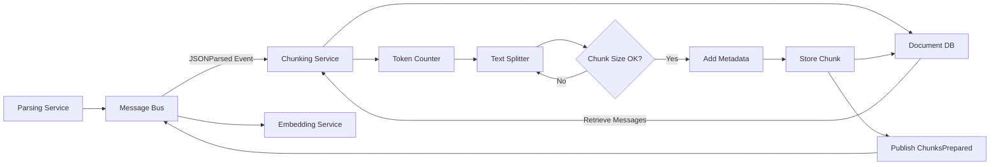

<!-- SPDX-License-Identifier: MIT
  Copyright (c) 2025 Copilot-for-Consensus contributors -->
# Chunking Service

## Overview

The Chunking Service splits long email bodies from parsed messages into smaller, semantically coherent text chunks suitable for embedding generation. This service ensures that text segments remain within token limits for embedding models while maintaining context through strategic overlapping and metadata preservation.

## Purpose

Split long email bodies into smaller, semantically coherent chunks that:
- Fit within embedding model token limits
- Preserve semantic meaning and context
- Enable efficient vector search and retrieval
- Maintain traceability back to source messages

## Responsibilities

- **Token-Aware Splitting:** Respect embedding model token limits (typically 384-512 tokens)
- **Semantic Coherence:** Split on natural boundaries (paragraphs, sentences) rather than arbitrary character counts
- **Overlap Management:** Create overlapping chunks to preserve context across boundaries
- **Metadata Preservation:** Attach message metadata (thread ID, message ID, sender, date) to each chunk
- **Chunk Indexing:** Maintain sequential order of chunks within messages
- **Event Publishing:** Notify downstream services when chunks are ready for embedding
- **Storage:** Persist chunks to document database for reference and retrieval

## Technology Stack

- **Language:** Python 3.10+
- **Core Libraries:**
  - `langchain` Text Splitters for intelligent chunking
  - `tiktoken` or `transformers` for token counting
  - `pymongo` for document database integration
  - `pika` (RabbitMQ) or Azure SDK for message bus integration
- **Storage:** MongoDB or Azure Cosmos DB for chunk persistence

## Configuration

### Environment Variables

| Variable | Type | Required | Default | Description |
|----------|------|----------|---------|-------------|
| `MESSAGE_BUS_HOST` | String | Yes | `messagebus` | Message bus hostname |
| `MESSAGE_BUS_PORT` | Integer | No | `5672` | Message bus port |
| `MESSAGE_BUS_USER` | String | No | `guest` | Message bus username |
| `MESSAGE_BUS_PASSWORD` | String | No | `guest` | Message bus password |
| `DOCUMENT_DATABASE_HOST` | String | Yes | `documentdb` | Document database hostname |
| `DOCUMENT_DATABASE_PORT` | Integer | No | `27017` | Document database port |
| `DOCUMENT_DATABASE_NAME` | String | No | `copilot` | Database name |
| `DOCUMENT_DATABASE_USER` | String | No | - | Database username (if auth enabled) |
| `DOCUMENT_DATABASE_PASSWORD` | String | No | - | Database password (if auth enabled) |
| `CHUNK_SIZE_TOKENS` | Integer | No | `384` | Target chunk size in tokens |
| `CHUNK_OVERLAP_TOKENS` | Integer | No | `50` | Overlap between chunks in tokens |
| `MIN_CHUNK_SIZE_TOKENS` | Integer | No | `100` | Minimum chunk size (discard smaller) |
| `MAX_CHUNK_SIZE_TOKENS` | Integer | No | `512` | Maximum chunk size (hard limit) |
| `CHUNKING_STRATEGY` | String | No | `recursive` | Strategy: recursive, sentence, paragraph |
| `SEPARATORS` | String | No | `\n\n,\n,. ` | Separators for chunking (comma-separated) |
| `LOG_LEVEL` | String | No | `INFO` | Logging level (DEBUG, INFO, WARNING, ERROR) |
| `BATCH_SIZE` | Integer | No | `10` | Number of messages to process in batch |

### Chunking Strategies

**Recursive Character Text Splitting** (default):
- Tries to split on paragraph breaks (`\n\n`), then line breaks (`\n`), then sentences (`. `), then words
- Most flexible and maintains semantic coherence

**Sentence Splitting:**
- Splits on sentence boundaries
- Better for preserving complete thoughts
- May produce variable-sized chunks

**Paragraph Splitting:**
- Splits on paragraph boundaries
- Preserves high-level context
- May exceed token limits for long paragraphs

## Events

### Events Subscribed To

The Chunking Service subscribes to the following events. See [SCHEMA.md](../documents/SCHEMA.md#message-bus-event-schemas) for complete event schemas.

#### 1. JSONParsed

Consumes events from the Parsing & Normalization Service when messages are parsed.

**Exchange:** `copilot.events`
**Routing Key:** `json.parsed`

See [JSONParsed schema](../documents/SCHEMA.md#3-jsonparsed) in SCHEMA.md for the complete payload definition.

**Processing:**
1. Retrieve messages by `_id` from document database
2. Extract `body_normalized` field for chunking
3. Create chunks with metadata
4. Store chunks in document database
5. Publish `ChunksPrepared` event

### Events Published

The Chunking Service publishes the following events. See [SCHEMA.md](../documents/SCHEMA.md#message-bus-event-schemas) for complete event schemas.

#### 1. ChunksPrepared

Published when messages have been successfully chunked and stored.

**Exchange:** `copilot.events`
**Routing Key:** `chunks.prepared`

See [ChunksPrepared schema](../documents/SCHEMA.md#5-chunksprepared) in SCHEMA.md for the complete payload definition.

**Key Fields:**
- `archive_id`: Archive identifier processed
- `chunk_count`: Total number of chunks created
- `chunk_ids`: List of canonical chunk identifiers (_id) for embedding service
- `chunks_ready`: Boolean indicating chunks are stored and ready
- `chunking_strategy`: Strategy used for chunking
- `avg_chunk_size_tokens`: Average chunk size for monitoring

#### 2. ChunkingFailed

Published when chunking fails for a batch of messages.

**Exchange:** `copilot.events`
**Routing Key:** `chunks.failed`

See [ChunkingFailed schema](../documents/SCHEMA.md#6-chunkingfailed) in SCHEMA.md for the complete payload definition.

**Key Fields:**
- `archive_id`: Archive identifier
- `chunk_ids`: List of canonical chunk identifiers (_id) that failed
- `error_message`, `error_type`: Error details
- `retry_count`: Number of retry attempts

## Data Flow



## Chunk Structure

### Stored Document Schema

Each chunk is stored in the `chunks` collection:

```python
{
    "_id": "a1b2c3d4e5f6789abcdef123456789ab",
    "message_id": "<20231015123456.ABC123@example.com>",
    "thread_id": "<20231015120000.XYZ789@example.com>",
    "archive_id": "b9c8d7e6f5a4b3c",
    "chunk_index": 0,
    "text": "I agree with the proposed approach for connection migration...",
    "token_count": 350,
    "start_offset": 0,
    "end_offset": 1024,
    "overlap_with_previous": False,
    "overlap_with_next": True,
    "metadata": {
        "sender": "alice@example.com",
        "sender_name": "Alice Developer",
        "date": "2023-10-15T12:34:56Z",
        "subject": "Re: QUIC connection migration concerns",
        "draft_mentions": ["draft-ietf-quic-transport-34"]
    },
    "chunking_strategy": "recursive",
    "created_at": "2023-10-15T14:40:00Z",
    "embedding_generated": False
}
```

### Field Descriptions

| Field | Type | Description |
|-------|------|-------------|
| `_id` | String (SHA256 hash, 16 chars) | Unique identifier for chunk (canonical) |
| `message_id` | String | Source message Message-ID |
| `thread_id` | String | Thread identifier |
| `archive_id` | String (SHA256 hash, 16 chars) | Source archive identifier |
| `chunk_index` | Integer | Sequential position within message (0-based) |
| `text` | String | Actual chunk text content |
| `token_count` | Integer | Number of tokens in chunk |
| `start_offset` | Integer | Character offset in original message body |
| `end_offset` | Integer | End character offset |
| `overlap_with_previous` | Boolean | Whether chunk overlaps with previous |
| `overlap_with_next` | Boolean | Whether chunk overlaps with next |
| `metadata` | Object | Context information for search/retrieval |
| `chunking_strategy` | String | Strategy used to create chunk |
| `created_at` | DateTime | When chunk was created |
| `embedding_generated` | Boolean | Track embedding status |

## Chunking Algorithm

### Recursive Character Text Splitting (Default)

```python
def chunk_message(message_text: str, config: ChunkConfig) -> List[Chunk]:
    """
    Split message text into chunks using recursive strategy.

    Args:
        message_text: Normalized message body
        config: Chunking configuration

    Returns:
        List of chunk objects with metadata
    """
    # 1. Initialize text splitter
    splitter = RecursiveCharacterTextSplitter(
        chunk_size=config.chunk_size_tokens,
        chunk_overlap=config.chunk_overlap_tokens,
        separators=["\n\n", "\n", ". ", " ", ""],
        length_function=count_tokens
    )

    # 2. Split text
    text_chunks = splitter.split_text(message_text)

    # 3. Create chunk objects with metadata
    chunks = []
    offset = 0
    for i, text in enumerate(text_chunks):
        chunk = {
            "_id": sha256_hash(f"{message_id}_{i}"),
            "chunk_index": i,
            "text": text,
            "token_count": count_tokens(text),
            "start_offset": offset,
            "end_offset": offset + len(text),
            "overlap_with_previous": i > 0 and config.chunk_overlap_tokens > 0,
            "overlap_with_next": i < len(text_chunks) - 1
        }
        chunks.append(chunk)
        offset += len(text)

    return chunks
```

### Token Counting

```python
def count_tokens(text: str, model: str = "cl100k_base") -> int:
    """
    Count tokens in text using specified encoding.

    Args:
        text: Input text
        model: Tokenizer model (for tiktoken)

    Returns:
        Number of tokens
    """
    import tiktoken
    encoding = tiktoken.get_encoding(model)
    return len(encoding.encode(text))
```

## Processing Logic

### Main Processing Loop

```python
async def process_json_parsed_event(event: JSONParsedEvent):
    """
    Process a JSONParsed event and create chunks.
    """
    try:
        # 1. Retrieve messages from database
        messages = db.messages.find({
            "_id": {"$in": event.data.message_doc_ids}
        })

        # 2. Process each message
        all_chunks = []
        for message in messages:
            # Extract normalized body
            text = message.get("body_normalized", "")

            if not text or len(text.strip()) == 0:
                logger.warning(f"Empty message body: {message['message_id']}")
                continue

            # Create chunks
            chunks = chunk_message(text, chunk_config)

            # Add message metadata to each chunk
            for chunk in chunks:
                chunk.update({
                    "message_id": message["message_id"],
                    "thread_id": message["thread_id"],
                    "archive_id": message["archive_id"],
                    "metadata": {
                        "sender": message["from"]["email"],
                        "sender_name": message["from"]["name"],
                        "date": message["date"],
                        "subject": message["subject"],
                        "draft_mentions": message.get("draft_mentions", [])
                    },
                    "chunking_strategy": chunk_config.strategy,
                    "created_at": datetime.now(timezone.utc),
                    "embedding_generated": False
                })
                all_chunks.append(chunk)

        # 3. Store chunks in database
        if all_chunks:
            db.chunks.insert_many(all_chunks)
            logger.info(f"Created {len(all_chunks)} chunks")

        # 4. Publish ChunksPrepared event
        await publish_chunks_prepared_event(
            message_doc_ids=event.data.message_doc_ids,
            chunk_ids=[c["_id"] for c in all_chunks],
            chunk_count=len(all_chunks)
        )

    except Exception as e:
        logger.error(f"Chunking failed: {e}")
        await publish_chunking_failed_event(
            message_doc_ids=event.data.message_doc_ids,
            error=str(e)
        )
        raise
```

## API Endpoints

The service exposes HTTP endpoints for health checks and manual operations:

### GET /health

Health check endpoint.

**Response:**
```json
{
  "status": "healthy",
  "service": "chunking",
  "version": "1.0.0",
  "uptime_seconds": 3600,
  "chunks_created_total": 12450,
  "last_processing_time_seconds": 2.3
}
```

### POST /chunk/{message_id}

Manually trigger chunking for a specific message.

**Parameters:**
- `message_id`: Message-ID to chunk

**Response:**
```json
{
  "status": "success",
  "message_id": "<20231015123456.ABC123@example.com>",
  "chunk_count": 3,
  "chunk_ids": [
    "a1b2c3d4-e5f6-7890-abcd-ef1234567890",
    "b2c3d4e5-f678-90ab-cdef-123456789012",
    "c3d4e5f6-7890-abcd-ef12-34567890abcd"
  ]
}
```

### GET /stats

Get chunking statistics.

**Response:**
```json
{
  "total_chunks": 12450,
  "total_messages_processed": 5200,
  "avg_chunks_per_message": 2.4,
  "avg_chunk_size_tokens": 345,
  "min_chunk_size_tokens": 100,
  "max_chunk_size_tokens": 512
}
```

## Error Handling

### Error Types

- `DatabaseConnectionError`: Cannot connect to document database
- `MessageNotFoundError`: Referenced message not found in database
- `InvalidMessageFormatError`: Message missing required fields
- `ChunkingSizeError`: Chunk exceeds maximum size
- `TokenCountError`: Token counting failed

### Retry Logic

- Failed events are retried up to 3 times with exponential backoff
- Permanently failed messages are logged and skipped
- Dead-letter queue captures failed events for manual investigation

## Monitoring & Observability

### Metrics

Prometheus metrics exposed on `/metrics`:

- `chunking_messages_processed_total`: Total messages processed (labeled by status)
- `chunking_chunks_created_total`: Total chunks created
- `chunking_duration_seconds`: Histogram of chunking duration per message
- `chunking_chunk_size_tokens`: Histogram of chunk sizes in tokens
- `chunking_chunks_per_message`: Histogram of chunks per message
- `chunking_failures_total`: Total failures (labeled by error_type)

### Logs

Structured JSON logging:

```json
{
  "timestamp": "2023-10-15T14:40:00Z",
  "level": "INFO",
  "service": "chunking",
  "message": "Messages chunked successfully",
  "context": {
    "message_count": 10,
    "chunk_count": 25,
    "avg_chunk_size": 340,
    "duration_seconds": 1.5
  }
}
```

## Dependencies

### Runtime Dependencies

- **Message Bus:** RabbitMQ or Azure Service Bus
- **Document Database:** MongoDB or Azure Cosmos DB

### Service Dependencies

- **Parsing Service:** Provides parsed messages via `JSONParsed` events
- **Embedding Service:** Consumes chunks via `ChunksPrepared` events

## Development

### Running Locally

```bash
# Install dependencies
pip install -r requirements.txt

# Set environment variables
export MESSAGE_BUS_HOST=localhost
export DOCUMENT_DATABASE_HOST=localhost

# Run the service
python main.py
```

### Running in Docker

```bash
# Build image
docker build -t copilot-chunking .

# Run container
docker run -d \
  -e MESSAGE_BUS_HOST=messagebus \
  -e DOCUMENT_DATABASE_HOST=documentdb \
  copilot-chunking
```

### Testing

```bash
# Run unit tests
pytest tests/

# Test chunking logic
pytest tests/test_chunking.py -v

# Integration tests
pytest tests/integration/ --integration
```

## Future Enhancements

- [ ] Adaptive chunking based on content type (code vs prose)
- [ ] Semantic chunking using sentence embeddings
- [ ] Multi-lingual tokenization support
- [ ] Chunk quality scoring
- [ ] Dynamic chunk size based on embedding model
- [ ] Parallel processing of large message batches
- [ ] Chunk caching for identical message bodies
- [ ] Support for markdown-aware chunking
