```mermaid
graph TB
    subgraph "Current Architecture: Container Apps"
        SB1[Service Bus Queue<br/>json.parsed]
        CA1[Container App<br/>Chunking Service<br/>Always On - $29/month]
        CA1_HTTP[FastAPI Server<br/>/health, /metrics]
        CA1_SUB[Manual Subscriber<br/>Background Thread]
        CA1_PROC[ChunkingService<br/>process_messages]
        PROM[Prometheus<br/>Metrics Scraping]
        
        SB1 --> CA1_SUB
        CA1_SUB --> CA1_PROC
        CA1_HTTP --> PROM
        CA1_PROC --> DB1[(Cosmos DB)]
        CA1_PROC --> SB2[Service Bus<br/>chunks.prepared]
        
        style CA1 fill:#ff9999
        style CA1_HTTP fill:#ffcccc
        style CA1_SUB fill:#ffcccc
    end
    
    subgraph "Proposed Architecture: Azure Functions"
        SB3[Service Bus Queue<br/>json.parsed]
        FUNC[Azure Function<br/>Chunking Function<br/>Scale-to-Zero - $0.20/month]
        FUNC_TRIG[Service Bus Trigger<br/>Native Integration]
        FUNC_PROC[ChunkingService<br/>process_messages<br/>REUSED]
        APPINS[Application Insights<br/>Auto Telemetry]
        
        SB3 --> FUNC_TRIG
        FUNC_TRIG --> FUNC_PROC
        FUNC --> APPINS
        FUNC_PROC --> DB2[(Cosmos DB)]
        FUNC_PROC --> SB4[Service Bus<br/>chunks.prepared]
        
        style FUNC fill:#99ff99
        style FUNC_TRIG fill:#ccffcc
    end
    
    subgraph "Cost Comparison (30K msgs/month)"
        COST_CA["Container App:<br/>$29.30/month<br/>(always-on)"]
        COST_FUNC["Azure Function:<br/>$5.20/month<br/>(pay-per-execution)"]
        SAVINGS["💰 Savings:<br/>82%<br/>($24/month per service)"]
        
        COST_CA -.->|"vs"| COST_FUNC
        COST_FUNC --> SAVINGS
        
        style COST_CA fill:#ff9999
        style COST_FUNC fill:#99ff99
        style SAVINGS fill:#99ccff
    end
    
    subgraph "Migration Complexity"
        CODE1["Container App Code:<br/>230 lines<br/>FastAPI + Manual Consumer"]
        CODE2["Function Code:<br/>200 lines<br/>Trigger + Handler"]
        REUSE["Reused Code:<br/>90%<br/>ChunkingService logic"]
        
        CODE1 -.->|"refactor"| CODE2
        CODE2 --> REUSE
        
        style CODE1 fill:#ffcccc
        style CODE2 fill:#ccffcc
        style REUSE fill:#ccffcc
    end
```

# Azure Functions Migration - Visual Overview

## Architecture Comparison

### Current: Container Apps
- **Always-On**: Container runs 24/7 even when idle
- **Manual Consumer**: Background thread with Service Bus SDK
- **HTTP Server**: FastAPI for health checks and metrics scraping
- **Cost**: $29.30/month per service (1 replica)

### Proposed: Azure Functions
- **Scale-to-Zero**: No instances when queue is empty
- **Native Trigger**: Service Bus trigger binding (zero code)
- **No HTTP Server**: Platform handles health checks
- **Cost**: $5.20/month per service (30K messages)

## Cost Impact

| Scenario | Container Apps | Functions | Savings |
|----------|----------------|-----------|---------|
| **Dev/Test (low volume)** | $146.50/mo | $1.00/mo | **99%** |
| **Production (30K msgs)** | $426.50/mo | $301.00/mo | **29%** |
| **Production (100K msgs)** | $426.50/mo | $361.00/mo | **15%** |
| **Annual (5 services)** | $5,118/year | $3,612/year | **$1,506/year** |

## Migration Effort

- **Code Changes**: ~60 net lines per service
- **Business Logic**: 0% change (fully reused)
- **Time Estimate**: 1-2 days per service
- **Risk Level**: ✅ Low (easy rollback)

## Performance Comparison

| Metric | Container Apps | Functions (Cold) | Functions (Warm) |
|--------|----------------|------------------|------------------|
| Startup | N/A (always on) | ~3 seconds | N/A |
| Processing | ~2 seconds | ~2 seconds | ~2 seconds |
| Latency | ✅ ~2s | ⚠️ ~5s | ✅ ~2s |

## Decision Matrix

### ✅ Use Azure Functions For:
- Dev and test environments (massive savings)
- Production with <200K messages/month
- Services with irregular traffic patterns
- New message consumer services

### 🔄 Keep Container Apps For:
- Production with >200K messages/month
- Services requiring <100ms latency guarantee
- Complex services with heavy state management
- Services already optimized for Container Apps

### 🎯 Hybrid Approach (Recommended):
- **Simple services** (chunking, parsing, embedding) → Functions
- **Complex services** (orchestrator) → Container Apps
- **Best of both worlds**: Cost optimization + Performance

## Phased Migration Plan

```
Phase 1: POC ✅ [COMPLETE]
└── Implement chunking function
└── Create infrastructure
└── Document findings

Phase 2: Pilot 🔄 [NEXT]
└── Deploy to dev environment
└── Parallel processing (2 weeks)
└── Measure: cost, latency, reliability

Phase 3: Expand ⏳ [IF SUCCESSFUL]
└── Migrate parsing, embedding
└── Canary deployment to prod
└── Monitor and optimize

Phase 4: Complex ⏳ [OPTIONAL]
└── Evaluate orchestrator
└── May need Durable Functions
└── Or keep on Container Apps
```

## Key Benefits

### Cost Optimization
- **99% savings** in dev/test environments
- **29-82% savings** in production (depending on volume)
- Scale-to-zero eliminates idle costs
- Pay only for actual message processing

### Operational Benefits
- **Automatic scaling** based on queue depth
- **Native Service Bus integration** (less code)
- **Faster deployment** (no Docker, 5x faster)
- **Built-in retry logic** and dead-letter handling
- **Simpler infrastructure** (no Container Apps environment)

### Developer Experience
- **Less boilerplate** (~140 lines removed per service)
- **Standard pattern** (Azure Functions + Service Bus)
- **Better local development** (Azure Functions Core Tools)
- **Easier debugging** (built-in Application Insights)

## Trade-offs

### Considerations

⚠️ **Cold Start Latency**: 1-5 seconds for first invocation
- **Impact**: Low (async processing, users don't wait)
- **Mitigation**: Premium Plan eliminates cold starts ($150/month)

⚠️ **Monitoring Changes**: Application Insights vs Prometheus
- **Impact**: Medium (different tooling)
- **Mitigation**: Hybrid monitoring or Grafana Application Insights plugin

⚠️ **Learning Curve**: Team must learn Azure Functions
- **Impact**: Low (similar patterns, good documentation)
- **Time**: 1-2 weeks for team to become proficient

## Recommendation

**✅ Proceed with phased migration starting with chunking service pilot**

**Rationale**:
1. **High ROI**: $1,506+ annual savings for 5 services
2. **Low Risk**: Minimal code changes, easy rollback
3. **Proven Pattern**: POC successful, infrastructure ready
4. **Strategic Fit**: Aligns with cloud-native best practices

**Next Step**: Deploy chunking function to dev environment for 2-week pilot evaluation.
