```mermaid
graph LR
    A[📥 Ingestion] --> B[📬 Message Bus]
    B --> C[🔍 Parsing]
    C --> D[🗄️ Document DB]
```

<!-- SPDX-License-Identifier: MIT
  Copyright (c) 2025 Copilot-for-Consensus contributors -->
# Documentation Conventions

This document defines the documentation standards and conventions for the Copilot-for-Consensus project. Following these guidelines ensures consistency, maintainability, and ease of onboarding for new contributors.

***

## General Principles

1. **Keep Documentation Close to Code**: Service-specific documentation should live in the service directory (e.g., `parsing/README.md`).
2. **Update Docs with Code**: When making code changes, update relevant documentation in the same PR.
3. **Write for Newcomers**: Assume readers are unfamiliar with the project but have general software development knowledge.
4. **Use Clear, Concise Language**: Avoid jargon where possible; explain technical terms when necessary.
5. **Provide Examples**: Include code snippets, command examples, and sample configurations.

For configuration work specifically, follow the principles in [docs/SCHEMA_DRIVEN_CONFIGURATION.md](SCHEMA_DRIVEN_CONFIGURATION.md).

***

## File Organization

### Root-Level Documentation

The repository root contains high-level governance and project documentation:

- **README.md**: Project overview, quick start, architecture summary
- **CONTRIBUTING.md**: Contribution guidelines, development setup, review process
- **CODE_OF_CONDUCT.md**: Community standards and behavior expectations
- **GOVERNANCE.md**: Decision-making processes, roles, and responsibilities
- **SECURITY.md**: Security policy and vulnerability reporting
- **LICENSE**: MIT License text

### docs/ Directory

The `docs/` directory contains detailed technical documentation organized by topic:

- **operations/**: Deployment, configuration, monitoring, troubleshooting
- **observability/**: Metrics, logging, tracing, and monitoring patterns
- **architecture/**: System design, data flow, and component interactions
- **schemas/**: Data storage schemas and message bus event definitions
- **features/**: Feature-specific integration guides (authentication, vectorstore, gateway TLS)
- **gateway/**: API Gateway deployment guides for various providers

### Service Documentation

Each microservice directory should contain:

- **README.md**: Service overview, purpose, configuration, API endpoints
- **Dockerfile**: Containerization with inline comments
- **.env.example**: Example environment variables with descriptions

### Adapter Documentation

Each adapter directory should contain:

- **README.md**: Adapter interface, implementations, usage examples
- **examples/**: Code examples showing typical usage patterns

***

## Markdown Style Guide

### Headers

- Use ATX-style headers (`#`, `##`, `###`)
- Capitalize first word and proper nouns only ("Docker Compose setup", not "Docker Compose Setup")
- Use horizontal rules (`***`) to separate major sections

### Code Blocks

- Always specify language for syntax highlighting:
  ````markdown
  ```python
  def example():
      pass
  ```
  ````

- Use `bash` for shell commands:
  ````markdown
  ```bash
  docker compose up -d
  ```
  ````

- For multi-platform commands, provide both bash and PowerShell examples:
  ````markdown
  **Linux/macOS:**
  ```bash
  export VAR=value
  ```

  **Windows (PowerShell):**
  ```powershell
  $env:VAR = "value"
  ```
  ````

### Tables

- Use GitHub Flavored Markdown tables
- Align headers and separators for readability:
  ```markdown
  | Column 1 | Column 2 | Column 3 |
  |----------|----------|----------|
  | Value A  | Value B  | Value C  |
  ```

### Links

- Use relative paths for internal documentation: `[Architecture overview](./docs/architecture/overview.md)`
- Use descriptive link text: `See [configuration guide](./docs/CONFIGURATION.md)` not `click here`

### Lists

- Use `-` for unordered lists (consistent with existing docs)
- Use `*` for emphasis-heavy lists (governance, feature lists)
- Indent nested lists with 2 spaces

***

## Service README Structure

Each service README should follow this structure:

### 1. Header and Overview

```markdown
<!-- SPDX-License-Identifier: MIT
  Copyright (c) 2025 Copilot-for-Consensus contributors -->
# [Service Name] Service

## Overview

Brief 2-3 sentence description of what the service does.

## Purpose

Detailed explanation of the service's role in the system.
```

### 2. Responsibilities

```markdown
## Responsibilities

- **Bullet 1**: Specific responsibility
- **Bullet 2**: Another responsibility
```

### 3. Technology Stack

```markdown
## Technology Stack

- **Language**: Python 3.10+
- **Core Libraries**:
  - Library 1: Purpose
  - Library 2: Purpose
- **Storage**: Database or storage system used
```

### 4. Configuration

```markdown
## Configuration

### Environment Variables

| Variable | Type | Required | Default | Description |
|----------|------|----------|---------|-------------|
| `VAR_NAME` | String | Yes | - | Description |
```

### 5. Events (if applicable)

```markdown
## Events

### Events Subscribed To

#### 1. EventName

**Exchange**: `copilot.events`
**Routing Key**: `event.name`

See [data-storage schema](../docs/schemas/data-storage.md#message-bus-event-schemas) for event references and links to JSON schemas.

### Events Published

#### 1. EventName

Similar structure as above.
```

### 6. Data Flow

Include a Mermaid diagram if the service has complex interactions:

```markdown
## Data Flow


```

### 7. API Endpoints (if applicable)

```markdown
## API Endpoints

### GET /health

**Response:**
```json
{
  "status": "healthy"
}
```
```

### 8. Development

```markdown
## Development

### Running Locally

```bash
pip install -r requirements.txt
python main.py
```

### Testing

```bash
pytest tests/
```
```

***

## Adapter README Structure

Adapter READMEs should include:

1. **Overview**: What the adapter abstracts
2. **Interface**: Abstract base class or protocol definition
3. **Implementations**: Available concrete implementations
4. **Usage Examples**: Code showing typical usage
5. **Configuration**: How to configure and instantiate
6. **Testing**: Test-friendly implementations

***

## Configuration Documentation

### Environment Variables

When documenting environment variables:

1. Use a table with columns: Variable, Type, Required, Default, Description
2. Group related variables (e.g., all database vars together)
3. Indicate if a variable is optional and what happens when not set
4. Provide example values where helpful

Example:

```markdown
| Variable | Type | Required | Default | Description |
|----------|------|----------|---------|-------------|
| `MESSAGE_BUS_HOST` | String | Yes | `messagebus` | Message bus hostname |
| `MESSAGE_BUS_PORT` | Integer | No | `5672` | Message bus port |
```

### Configuration Files

When documenting JSON/YAML configs:

- Show complete examples
- Annotate with inline comments (for JSON, show as separate documentation)
- Link to schema files where available

***

## Naming Conventions

### Services

- Use kebab-case for directory names: `parsing`, `reporting`, `ui`
- Use descriptive names that indicate purpose: `parsing`, not `parser`

### Adapters

- Prefix with `copilot_`: `copilot_storage`, `copilot_message_bus`
- Use singular nouns: `copilot_config`, not `copilot_configs`

### Documentation Files

- Use SCREAMING_SNAKE_CASE for technical docs: `ARCHITECTURE.md`, `SCHEMA.md`
- Use Title Case for guides: `README.md`
- Use kebab-case for supporting docs: `chunking_architecture.md`

### Message Bus Events

- Use PascalCase: `ArchiveIngested`, `JSONParsed`, `ChunksPrepared`
- Use past tense for completion events: `EmbeddingsGenerated`
- Use descriptive names: `ChunksPrepared` not `ChunksReady`

***

## Coding Conventions

### Configuration and Environment Variables

**Rule: Service runtime code MUST NOT read OS environment variables directly.**

Service code should use typed, schematized configuration objects instead of reading environment variables with `os.environ.get()`, `os.getenv()`, or `os.environ[]`. This ensures:

- **Type safety**: Configuration is validated at startup
- **Documentation**: Schema serves as single source of truth
- **Testability**: Easy to mock configuration in tests
- **Deployment consistency**: Same validation across all environments

**Bad:**
```python
# DON'T: Reading env vars directly bypasses schema validation
retry_limit = int(os.environ.get('RETRY_LIMIT', '3'))
batch_size = int(os.getenv('BATCH_SIZE', '32'))
```

**Good:**
```python
# DO: Use typed config from schema
from copilot_config.runtime_loader import get_config
from copilot_config.generated.services.myservice import ServiceConfig_MyService

config = get_config("myservice")
retry_limit = config.service_settings.retry_limit
batch_size = config.service_settings.batch_size
```

**CI Enforcement:**

The CI pipeline runs `scripts/check_no_runtime_env_vars.py` to detect direct environment variable access in service code. This check scans:
- `auth/`, `chunking/`, `embedding/`, `ingestion/`, `orchestrator/`, `parsing/`, `reporting/`, `summarization/`
- Excludes: `**/tests/**`, `scripts/**`

**Exceptions:**

Rare cases requiring direct env var access (e.g., backward compatibility fallbacks) can be allowlisted in `scripts/env_var_allowlist.txt`. Each exception requires:
1. A comment explaining why it's needed
2. A migration plan (for backward compatibility cases)
3. Optional regex pattern to limit scope

Example allowlist entry:
```
# Backward compatibility: Legacy RETRY_MAX env var fallback
# TODO: Remove after v2.0 migration
myservice/main.py:RETRY_MAX
```

For more details on configuration, see [SCHEMA_DRIVEN_CONFIGURATION.md](SCHEMA_DRIVEN_CONFIGURATION.md).

***

## Diagram Guidelines

### Mermaid Diagrams

Use Mermaid for:
- Data flow diagrams (`graph LR`)
- Sequence diagrams (`sequenceDiagram`)
- State diagrams (`stateDiagram-v2`)

Best practices:
- Keep diagrams simple and focused
- Use descriptive node labels with emoji where helpful
- Include legend if symbols aren't obvious

Example:



***

## Code Examples

### Python Examples

- Use type hints consistently
- Include docstrings for functions
- Show imports explicitly
- Keep examples runnable (avoid pseudo-code)

```python
from copilot_storage import create_document_store

def example_usage():
    """
    Example showing how to use the document store adapter.
    """
    store = create_document_store(
        store_type="mongodb",
        connection_string="mongodb://localhost:27017"
    )
    return store
```

### Shell Commands

- Show the full command with all necessary flags
- Include comments for complex commands
- Provide context about when to run the command

```bash
# Initialize the database after starting services
docker compose run --rm db-init
```

***

## Cross-References

### Linking to Other Documentation

- Use relative paths consistently
- Always verify links after moving or renaming files
- Link to specific sections using anchors: `[Schema](./SCHEMA.md#messages-collection)`

### Linking to Code

- Link to specific files or directories in the repository
- Use permanent links (commit SHAs) for external documentation
- For README links, use relative paths: `[Parser](./parsing/README.md)`

***

## Change Management

### When to Update Documentation

Update documentation when:

1. Adding a new service or adapter
2. Changing configuration variables
3. Modifying event schemas
4. Updating deployment processes
5. Changing API endpoints
6. Adding new dependencies

### Documentation Review Checklist

Before merging PRs that update documentation:

- [ ] All links are valid and use relative paths
- [ ] Code examples are syntactically correct
- [ ] Environment variables are documented in tables
- [ ] New services follow the standard README structure
- [ ] Diagrams are up to date
- [ ] Cross-references are accurate

***

## License Headers

All documentation files must include the SPDX license header:

```markdown
<!-- SPDX-License-Identifier: MIT
  Copyright (c) 2025 Copilot-for-Consensus contributors -->
```

This should be the first lines of every Markdown file.

***

## Version History

When making significant documentation changes:

1. Note the change in commit messages
2. Update the relevant section's "last updated" date if maintaining one
3. Consider adding a changelog entry for major documentation overhauls

***

## Questions and Improvements

If you find documentation that:
- Is unclear or confusing
- Contains outdated information
- Has broken links
- Lacks necessary detail

Please:
1. Open an issue with the `documentation` label
2. Propose improvements via pull request
3. Ask questions in GitHub Discussions

***

**Thank you for maintaining high-quality documentation!**
