<!-- SPDX-License-Identifier: MIT
  Copyright (c) 2025 Copilot-for-Consensus contributors -->
# Copilot-for-Consensus: Microservice Architecture

## Overview
This architecture is designed for a **containerized, microservice-based system** that ingests mailing list archives, processes them into structured chunks, generates embeddings, and orchestrates summarization workflows using **Semantic Kernel**. The goal is to deliver actionable insights and consensus reports for technical working groups.

### Deployment Models
The system is designed to be **100% self-contained and deployable locally** with optional configurations:
- **Fully Local (Offline):** All components run on-premises using open-source models (local micro-LLMs via Ollama, SentenceTransformers for embeddings, Qdrant/FAISS for vector storage, MongoDB for document storage).
- **Hybrid Cloud:** Leverage Azure services (Azure OpenAI, Azure Cognitive Search, Cosmos DB) for enterprise-scale deployments while maintaining containerized, portable architecture.
- **Modular LLM Support:** Seamlessly swap between:
  - **Local micro-LLMs:** Ollama-compatible models (e.g., Mistral, Llama 2), enabling fully offline operation
  - **Cloud LLMs:** Azure OpenAI, OpenAI API
  - **Open-source hosted:** Hugging Face Inference API, LM Studio

This design ensures the system can operate in air-gapped environments, resource-constrained setups, or enterprise cloud deployments with zero code changes.

## Core Components

### 1. Ingestion Service
- **Purpose:** Fetch mailing list archives (e.g., `.mbox` files) via `rsync` or IMAP.
- **Responsibilities:**
  - Scheduled sync from IETF or other sources.
  - Store raw archives in **Blob Storage** or local volume.
- **Technology:** Python scripts using `rsync` + `mailbox` or C# with MimeKit.

### 2. Parsing & Normalization Service
- **Purpose:** Convert raw `.mbox` files into structured JSON.
- **Responsibilities:**
  - Extract headers (`Message-ID`, `In-Reply-To`, `Subject`, `Date`).
  - Clean and normalize text (remove signatures, quoted replies, HTML tags).
- **Output:** JSON objects representing individual messages and threads.

### 3. Chunking Service
- **Purpose:** Split long email bodies into smaller, semantically coherent chunks.
- **Responsibilities:**
  - Token-aware splitting with overlap for context.
  - Maintain metadata (thread ID, message ID).
- **Tools:** LangChain Text Splitters or Semantic Kernel TextChunker.

### 4. Embedding Generation Service
- **Purpose:** Convert chunks into vector embeddings for semantic search.
- **Responsibilities:**
  - Call embedding model with multiple backend support:
    - **Local:** SentenceTransformers (fully offline)
    - **Cloud:** Azure OpenAI Embeddings API
    - **Hybrid:** Ollama-compatible embedding models
  - Attach embeddings to JSON and store in vector database.
- **Output:** `{chunk_text, metadata, embedding}`.
- **Self-Contained Option:** Use lightweight open-source models (e.g., `all-MiniLM-L6-v2`) for 100% offline operation.

### 5. Vector Store
- **Purpose:** Enable fast similarity search and retrieval.
- **Options:**
  - **Azure Cognitive Search** (vector + keyword hybrid)
  - **FAISS/Qdrant/Milvus** for open-source deployments
- **Responsibilities:**
  - Store embeddings with metadata.
  - Support top-k retrieval for retrieval-augmented generation (RAG) workflows.

### 6. Orchestration Layer (Semantic Kernel)
- **Purpose:** Coordinate summarization and analysis tasks.
- **Responsibilities:**
  - Invoke large language model (LLM) with flexible backend selection:
    - **Local micro-LLMs:** Ollama-hosted models (Mistral, Llama 2, etc.) for fully offline operation
    - **Cloud LLMs:** Azure OpenAI, OpenAI API
    - **Hybrid:** Route to local or cloud based on latency/cost requirements
  - For summarization tasks:
    - Thread summarization (extractive + abstractive)
    - Consensus/dissent detection
    - Draft mention tracking
  - Chain skills dynamically using Semantic Kernel Planner.
- **Technology:** Semantic Kernel with Python or .NET SDK.
- **Self-Contained:** Fully functional with local models; no external API dependencies required.

### 7. Summarization Service
- **Purpose:** Generate weekly summaries and insights.
- **Responsibilities:**
  - Aggregate chunks retrieved from vector store.
  - Produce structured summaries with inline citations.
- **Output:** Markdown/HTML reports.

### 8. Reporting & Front-End
- **Purpose:** Deliver insights to users.
- **Responsibilities:**
  - Web dashboard (Streamlit or React)
  - Export summaries in Markdown, HTML, or JSON
  - Integration with Teams/Slack for notifications.

### 9. Diagnostics & Monitoring
- **Purpose:** Ensure reliability and transparency.
- **Responsibilities:**
  - Log ingestion and processing steps.
  - Track LLM performance and cost metrics.
  - Monitor pipeline health with Prometheus/Grafana.

## Data Storage Layer

### Parsed JSON Storage
The Parsing & Normalization Service outputs structured JSON representing emails and threads. This data is persisted in:

- **Primary Store:** Document database (MongoDB, Azure Cosmos DB, or PostgreSQL with JSONB)
  - Stores parsed JSON documents with message metadata
  - Schema includes: `message_id`, `thread_id`, `subject`, `date`, `sender`, `body`, `headers`, `normalized_text`
  - Indexed by `message_id` and `thread_id` for fast retrieval
  - Enables queries like "find all messages in thread X" or "find message by ID"

- **Archive Storage:** Blob storage (Azure Blob, S3, or local volumes)
  - Raw `.mbox` files retained for audit/compliance
  - Optional: Compressed backups of original archives

### Processing Pipeline Data

- **Chunks:** Stored with embeddings in Vector Store (see Component #5)
- **Metadata:** Associated with each chunk for traceability (source message ID, thread ID, date, sender)
- **Intermediate states:** Optionally logged to Message Bus for audit trail

## Service Communication Architecture

### Pattern: Event-Driven with Message Bus

The system uses a **hybrid asynchronous/synchronous** communication model to maintain loose coupling and modularity:

#### Primary: Message Bus (Asynchronous)
- **Purpose:** Decouples services by publishing domain events
- **Implementation Options:**
  - **Azure Service Bus** (recommended for enterprise Azure deployments)
  - **RabbitMQ** (open-source, Kubernetes-friendly)
  - **Apache Kafka** (for high-throughput, event streaming)
  - **NATS** (lightweight, cloud-native)

- **Benefits:**
  - Services remain independent and unaware of each other
  - Add new consumers without modifying existing services
  - Built-in retry, dead-letter, and failure handling
  - Replace any service implementation without affecting others
  - Enables horizontal scaling of message consumers

#### Secondary: REST APIs (Synchronous)
- **Purpose:** Direct synchronous queries where immediate response is needed
- **Use Cases:**
  - Vector store queries during retrieval-augmented generation (Orchestration → Vector Store)
  - Front-end dashboard queries (Reporting → Vector Store, Document database)
  - Health checks and diagnostics

### Event Flow

Services communicate via these domain events:

1. **ArchiveIngested** (Ingestion → Message Bus)
   - Payload: `{archive_id, source, timestamp, file_path}`

2. **JSONParsed** (Parsing → Message Bus)
   - Payload: `{archive_id, message_count, parsed_json_document_ids, timestamp}`

3. **ChunksPrepared** (Chunking → Message Bus)
   - Payload: `{message_ids, chunk_count, chunks_ready, timestamp}`

4. **EmbeddingsGenerated** (Embedding → Message Bus)
   - Payload: `{chunk_ids, embedding_model, vector_store_updated, timestamp}`

5. **SummaryComplete** (Summarization → Message Bus)
   - Payload: `{thread_ids, summary_content, report_id, timestamp}`

## Data Flow Diagram

```mermaid
graph LR
    A["📥 Ingestion Service<br/>(rsync/IMAP)"] -->|ArchiveIngested| MB["📬 Message Bus<br/>(RabbitMQ/ServiceBus)"]
    
    MB -->|consume| B["🔍 Parsing Service<br/>(Extract & Normalize)"]
    B -->|JSONParsed| MB
    B -->|store JSON| DB["🗄️ Document DB<br/>(MongoDB/Cosmos)"]
    
    MB -->|consume| C["✂️ Chunking Service<br/>(token-aware splits)"]
    C -->|ChunksPrepared| MB
    
    MB -->|consume| D["🧠 Embedding Service<br/>(OpenAI/SentenceTransformers)"]
    D -->|EmbeddingsGenerated| MB
    D -->|store embeddings| VS["🔎 Vector Store<br/>(Azure Cognitive Search/Qdrant)"]
    
    MB -->|consume| E["⚙️ Orchestration Layer<br/>(Semantic Kernel)"]
    E -->|REST API| VS
    E -->|REST API| DB
    E -->|triggers| F["📝 Summarization Service<br/>(LLM summarization)"]
    
    F -->|SummaryComplete| MB
    F -->|store reports| DB
    
    G["🎨 Reporting & Front-End<br/>(Dashboard/Export)"] -->|REST API| VS
    G -->|REST API| DB
    
    H["📊 Diagnostics & Monitoring<br/>(Prometheus/Grafana)"] -.->|observe| MB
    H -.->|observe| DB
    H -.->|observe| VS
```

### Key Design Principles

- **Loose Coupling:** Services communicate via events, not direct calls
- **Modularity:** Each service has a single responsibility
- **Replaceability:** Swap implementations (e.g., different embedding models) without affecting other services
- **Resilience:** Message Bus handles retries, failures, and dead-letter queues
- **Scalability:** Horizontally scale any service independently based on message backlog
- **Observability:** All events flow through Message Bus for logging and monitoring