<!-- SPDX-License-Identifier: MIT
  Copyright (c) 2025 Copilot-for-Consensus contributors -->
# Data Storage Schema

This document defines the data storage schema for Copilot-for-Consensus, including document database collections, vector store structure, and the linkage between embeddings and source messages.

## Overview

The system uses two primary storage systems:
1. **Document Database (MongoDB/Cosmos DB)** - Stores structured message data, metadata, and summaries
2. **Vector Store (Qdrant/FAISS/Azure Cognitive Search)** - Stores embeddings with metadata for semantic search

## Document Database Schema

### Collection: `archives`
Stores metadata about ingested mailing list archives.

| Field | Type | Description | Indexed |
|-------|------|-------------|---------|
| `_id` | String (SHA256 hash, 16 chars) | Deterministic hash of mbox file (first 16 chars) — canonical primary key | Primary Key |
| `file_hash` | String (SHA256 hash, 64 chars) | Full SHA256 hash of the mbox file for integrity verification | Yes |
| `file_size_bytes` | Integer | Size of the original mbox file in bytes | No |
| `source` | String | Source identifier (e.g., "ietf-quic") | Yes |
| `source_url` | String | URL or path to original archive | No |
| `format` | String | Archive format (e.g., "mbox") | No |
| `ingestion_date` | DateTime | When the archive was ingested | Yes |
| `message_count` | Integer | Number of messages in archive | No |
| `file_path` | String | Storage path for raw archive | No |
| `status` | String | Processing status (pending, processed, failed) | Yes |

**Indexes:**
- Primary: `_id`
- Secondary: `source`, `file_hash`, `ingestion_date`, `status`

---

### Collection: `messages`
Stores parsed and normalized email messages.

| Field | Type | Description | Indexed |
|-------|------|-------------|---------|
| `_id` | String (SHA256 hash, 16 chars) | Deterministic hash of (archive_id\|message_id\|date\|sender\|subject) — canonical primary key | Primary Key |
| `message_id` | String | RFC 5322 Message-ID from email header | Yes |
| `archive_id` | String (SHA256 hash, 16 chars) | Hash of the mbox file this message came from | Yes |
| `thread_id` | String | Thread identifier (root message_id) | Yes |
| `in_reply_to` | String | Message-ID of parent message | Yes |
| `references` | Array[String] | List of referenced Message-IDs | No |
| `subject` | String | Email subject line | No |
| `from` | Object | Sender details (name, email) | No |
| `to` | Array[Object] | Recipients (name, email) | No |
| `cc` | Array[Object] | CC recipients | No |
| `date` | DateTime | Message timestamp | Yes |
| `body_raw` | String | Raw message body | No |
| `body_normalized` | String | Cleaned/normalized text | No |
| `body_html` | String | HTML content (if available) | No |
| `headers` | Object | Additional email headers | No |
| `attachments` | Array[Object] | Attachment metadata | No |
| `draft_mentions` | Array[String] | Mentioned RFC/draft identifiers | Yes |
| `created_at` | DateTime | Record creation timestamp | Yes |

**Indexes:**
- Primary: `_id`
- Secondary: `archive_id`, `thread_id`, `date`, `in_reply_to`, `draft_mentions`, `created_at`

**Example Document:**
```json
{
  "_id": "a1b2c3d4e5f6789",
  "message_id": "<20231015123456.ABC123@example.com>",
  "archive_id": "c3d4e5f6789a1b2",
  "thread_id": "<20231015120000.XYZ789@example.com>",
  "in_reply_to": "<20231015120000.XYZ789@example.com>",
  "references": ["<20231015120000.XYZ789@example.com>"],
  "subject": "Re: QUIC connection migration concerns",
  "from": {"name": "Alice Developer", "email": "alice@example.com"},
  "date": "2023-10-15T12:34:56Z",
  "body_normalized": "I agree with the proposed approach...",
  "draft_mentions": ["draft-ietf-quic-transport-34"],
  "created_at": "2023-10-15T13:00:00Z"
}
```

---

### Collection: `chunks`
Stores text chunks derived from messages for embedding generation.

| Field | Type | Description | Indexed |
|-------|------|-------------|---------|
| `_id` | String (SHA256 hash, 16 chars) | Deterministic hash of (message_id\|chunk_index) or (message_key\|chunk_index) — canonical primary key | Primary Key |
| `message_key` | String (SHA256 hash, 16 chars) | Reference to parent message | Yes |
| `message_id` | String | Source message Message-ID | Yes |
| `thread_id` | String | Thread identifier | Yes |
| `chunk_index` | Integer | Sequential index within message (0-based) | No |
| `text` | String | Chunk text content | No |
| `token_count` | Integer | Approximate token count | No |
| `start_offset` | Integer | Character offset in original message | No |
| `end_offset` | Integer | End character offset | No |
| `overlap_with_previous` | Boolean | Whether chunk overlaps with previous | No |
| `metadata` | Object | Additional context (sender, date, subject) | No |
| `created_at` | DateTime | Chunk creation timestamp | Yes |
| `embedding_generated` | Boolean | Whether embedding exists in vector store | Yes |

**Indexes:**
- Primary: `_id`
- Secondary: `message_key`, `message_id`, `thread_id`, `created_at`, `embedding_generated`

**Example Document:**
```json
{
  "_id": "b9c8d7e6f5a4b3c",
  "message_key": "a1b2c3d4e5f6789",
  "message_id": "<20231015123456.ABC123@example.com>",
  "thread_id": "<20231015120000.XYZ789@example.com>",
  "chunk_index": 0,
  "text": "I agree with the proposed approach for connection migration. The key concern is...",
  "token_count": 128,
  "start_offset": 0,
  "end_offset": 512,
  "overlap_with_previous": false,
  "metadata": {
    "sender": "alice@example.com",
    "date": "2023-10-15T12:34:56Z",
    "subject": "Re: QUIC connection migration concerns"
  },
  "created_at": "2023-10-15T13:05:00Z",
  "embedding_generated": true
}
```

---

### Collection: `threads`
Stores aggregated thread metadata for quick retrieval.

| Field | Type | Description | Indexed |
|-------|------|-------------|---------|
| `_id` | String | Thread identifier (root message_id) — canonical primary key | Primary Key |
| `archive_id` | String (SHA256 hash, 16 chars) | Hash of the mbox file this thread came from | Yes |
| `subject` | String | Thread subject (from root message) | No |
| `participants` | Array[Object] | List of participants (name, email) | No |
| `message_count` | Integer | Number of messages in thread | No |
| `first_message_date` | DateTime | Timestamp of first message | Yes |
| `last_message_date` | DateTime | Timestamp of most recent message | Yes |
| `draft_mentions` | Array[String] | All drafts mentioned in thread | Yes |
| `has_consensus` | Boolean | Whether consensus was detected | Yes |
| `consensus_type` | String | Type (agreement, dissent, mixed) | No |
| `summary_id` | String (UUID) | Reference to generated summary | Yes |
| `created_at` | DateTime | Thread record creation | Yes |

**Indexes:**
- Primary: `thread_id`
- Secondary: `archive_id`, `first_message_date`, `last_message_date`, `draft_mentions`, `has_consensus`, `summary_id`, `created_at`

---

### Collection: `summaries`
Stores generated summaries and reports.

| Field | Type | Description | Indexed |
|-------|------|-------------|---------|
| `summary_id` | String (UUID) | Unique identifier for summary | Primary Key |
| `thread_id` | String | Associated thread (null for multi-thread summaries) | Yes |
| `summary_type` | String | Type (thread, weekly, consensus, draft-focused) | Yes |
| `title` | String | Summary title | No |
| `content_markdown` | String | Summary content in Markdown | No |
| `content_html` | String | Summary content in HTML | No |
| `citations` | Array[Object] | References to source messages/chunks | No |
| `generated_by` | String | LLM model identifier | No |
| `generated_at` | DateTime | Generation timestamp | Yes |
| `metadata` | Object | Additional context (date range, participants) | No |

**Indexes:**
- Primary: `summary_id`
- Secondary: `thread_id`, `summary_type`, `generated_at`

**Citation Object Structure:**
```json
{
  "chunk_id": "b9c8d7e6f5a4b3c",
  "message_id": "<20231015123456.ABC123@example.com>",
  "quote": "I agree with the proposed approach...",
  "relevance_score": 0.92
}
```

---

## Vector Store Schema

### Vector Collection: `message_embeddings`
Stores embeddings with metadata for semantic search and retrieval-augmented generation (RAG).

#### Vector Structure

| Field | Type | Description |
|-------|------|-------------|
| `id` | String | Same as `chunk_id` from document DB |
| `vector` | Array[Float] | Embedding vector (e.g., 384 or 1536 dimensions) |
| `payload` | Object | Metadata payload (see below) |

#### Payload Schema

The payload contains metadata that links the embedding back to the source message and enables filtering during search.

```json
{
  "chunk_id": "b9c8d7e6f5a4b3c",
  "message_id": "<20231015123456.ABC123@example.com>",
  "thread_id": "<20231015120000.XYZ789@example.com>",
  "archive_id": "a1b2c3d4e5f6789",
  "chunk_index": 0,
  "text": "I agree with the proposed approach for connection migration...",
  "sender": "alice@example.com",
  "sender_name": "Alice Developer",
  "date": "2023-10-15T12:34:56Z",
  "subject": "Re: QUIC connection migration concerns",
  "draft_mentions": ["draft-ietf-quic-transport-34"],
  "token_count": 128,
  "embedding_model": "all-MiniLM-L6-v2",
  "embedding_date": "2023-10-15T13:10:00Z"
}
```

#### Payload Field Descriptions

| Field | Type | Purpose |
|-------|------|---------|
| `chunk_id` | String | Links to `chunks` collection in document DB |
| `message_id` | String | Links to `messages` collection; enables message-level retrieval |
| `thread_id` | String | Enables thread-level filtering and context |
| `archive_id` | String | Enables archive-level filtering |
| `chunk_index` | Integer | Preserves order within message |
| `text` | String | Actual chunk content for display/verification |
| `sender` | String | Enables filtering by author |
| `sender_name` | String | Human-readable author name |
| `date` | DateTime | Enables temporal filtering |
| `subject` | String | Provides context in search results |
| `draft_mentions` | Array[String] | Enables filtering by mentioned drafts/RFCs |
| `token_count` | Integer | Used for context window management |
| `embedding_model` | String | Tracks which model generated embedding |
| `embedding_date` | DateTime | Audit trail for embeddings |

---

## Linking Embeddings to Source Messages

### Forward Linkage (Embedding → Message)

Each vector in the vector store contains metadata that directly references:
1. **`chunk_id`** → Links to `chunks` collection
2. **`message_key`** → Links to `messages` collection
3. **`thread_id`** → Links to `threads` collection

**Retrieval Flow:**
```
Vector Search → Embedding Payload → chunk_id → chunks.message_id → messages → Full Message
```

**Example Query:**
```python
# 1. Perform vector similarity search
search_results = vector_store.search(
    query_embedding,
    limit=10,
    query_filter={"draft_mentions": "draft-ietf-quic-transport-34"}
)

# 2. Extract chunk_ids from results
chunk_ids = [r.payload["chunk_id"] for r in search_results]

# 3. Retrieve full chunks from document DB
chunks = db.chunks.find({"chunk_id": {"$in": chunk_ids}})

# 4. Retrieve full messages
message_keys = [c["message_key"] for c in chunks]
messages = db.messages.find({"message_key": {"$in": message_keys}})
```

### Reverse Linkage (Message → Embedding)

To find all embeddings for a given message:

**Via Document DB:**
```python
# 1. Find all chunks for a message
chunks = list(db.chunks.find({
  "message_key": "<20231015123456.ABC123@example.com>"
}))

# 2. Extract chunk_ids
chunk_ids = [c["chunk_id"] for c in chunks]

# 3. Retrieve embeddings from vector store
embeddings = vector_store.retrieve(chunk_ids)
```

**Via Vector Store Filter:**
```python
# Direct filter on vector store payload
embeddings = vector_store.scroll(
  scroll_filter={
    "message_key": "<20231015123456.ABC123@example.com>"
  }
)
```

---

## Key Relationships

### Entity-Relationship Diagram (Conceptual)

```
archives (1) ──< (N) messages
                    │
                    │ (1)
                    │
                    ├─< (N) chunks ───> (1:1) vector_embeddings
                    │                        (via chunk_id)
                    │
                    │ (N)
                    └─> (1) threads
                           │
                           │ (1)
                           └─> (1) summaries
```

### Primary Relationships

1. **Archive → Messages**: One archive contains many messages
   - FK: `messages.archive_id` → `archives.archive_id`

2. **Message → Chunks**: One message splits into many chunks
  - FK: `chunks.message_key` → `messages.message_key`

3. **Chunk → Embedding**: One chunk has one embedding (1:1)
   - FK: `vector_store.id` = `chunks.chunk_id`

4. **Thread → Messages**: One thread aggregates many messages
   - FK: `messages.thread_id` → `threads.thread_id`

5. **Thread → Summary**: One thread may have one summary
   - FK: `threads.summary_id` → `summaries.summary_id`

6. **Summary → Citations**: One summary references many chunks
   - Embedded: `summaries.citations[].chunk_id` → `chunks.chunk_id`

---

## Search and Retrieval Patterns

### Pattern 1: Semantic Search with Full Context

**Use Case:** Find relevant messages about a topic

```python
# 1. Vector search
results = vector_store.search(
    query_embedding,
    limit=20,
    query_filter={"date": {"$gte": "2023-10-01"}}
)

# 2. Enrich with full message context
enriched_results = []
for result in results:
    chunk = db.chunks.find_one({"chunk_id": result.id})
    message = db.messages.find_one({"message_id": chunk["message_id"]})
    thread = db.threads.find_one({"thread_id": message["thread_id"]})
    
    enriched_results.append({
        "score": result.score,
        "id": result.id,
        "payload": result.payload,
        "chunk": chunk["text"],
        "message": message["body_normalized"],
        "thread": thread["subject"],
        "sender": message["from"]
    })
```

### Pattern 2: Thread-Level Retrieval

**Use Case:** Get all embeddings for a thread

```python
# Option A: Via document DB
messages = list(db.messages.find({
    "thread_id": "<20231015120000.XYZ789@example.com>"
}))
message_keys = [m["message_key"] for m in messages]
chunks = list(db.chunks.find({"message_key": {"$in": message_keys}}))
embeddings = vector_store.retrieve([c["chunk_id"] for c in chunks])

# Option B: Direct vector store filter
embeddings = vector_store.scroll(
    scroll_filter={"thread_id": "<20231015120000.XYZ789@example.com>"}
)
```

### Pattern 3: Citation Verification

**Use Case:** Verify summary citations link to source

```python
summary = db.summaries.find_one({"summary_id": "..."})

for citation in summary["citations"]:
    # Retrieve chunk
    chunk = db.chunks.find_one({"chunk_id": citation["chunk_id"]})
    
    # Retrieve original message
    message = db.messages.find_one({"message_key": chunk["message_key"]})
    
    # Verify quote appears in chunk
    is_valid = citation["quote"] in chunk["text"]
    
    print(f"Citation valid: {is_valid}")
    print(f"Source: {message['from']['email']} on {message['date']}")
```

---

## Indexing Strategy

### Document Database Indexes

**MongoDB Index Definitions:**

```python
# archives collection
db.archives.create_index([("archive_id", 1)], unique=True)
db.archives.create_index([("source", 1), ("ingestion_date", -1)])
db.archives.create_index([("status", 1)])

# messages collection
db.messages.create_index([("message_id", 1)], unique=True)
db.messages.create_index([("archive_id", 1), ("date", -1)])
db.messages.create_index([("thread_id", 1), ("date", 1)])
db.messages.create_index([("draft_mentions", 1)])
db.messages.create_index([("from.email", 1), ("date", -1)])

# chunks collection
db.chunks.create_index([("chunk_id", 1)], unique=True)
db.chunks.create_index([("message_id", 1), ("chunk_index", 1)])
db.chunks.create_index([("thread_id", 1)])
db.chunks.create_index([("embedding_generated", 1), ("created_at", 1)])

# threads collection
db.threads.create_index([("thread_id", 1)], unique=True)
db.threads.create_index([("first_message_date", -1)])
db.threads.create_index([("draft_mentions", 1)])
db.threads.create_index([("has_consensus", 1), ("last_message_date", -1)])

# summaries collection
db.summaries.create_index([("summary_id", 1)], unique=True)
db.summaries.create_index([("thread_id", 1)])
db.summaries.create_index([("summary_type", 1), ("generated_at", -1)])
```

### Vector Store Indexes

**Qdrant Payload Indexes:**

```python
# Create payload indexes for filtering
client.create_payload_index(
    collection_name="message_embeddings",
    field_name="message_id",
    field_schema="keyword"
)

client.create_payload_index(
    collection_name="message_embeddings",
    field_name="thread_id",
    field_schema="keyword"
)

client.create_payload_index(
    collection_name="message_embeddings",
    field_name="date",
    field_schema="datetime"
)

client.create_payload_index(
    collection_name="message_embeddings",
    field_name="draft_mentions",
    field_schema="keyword"
)

client.create_payload_index(
    collection_name="message_embeddings",
    field_name="sender",
    field_schema="keyword"
)
```

---

## Data Integrity Constraints

### Referential Integrity

1. **Chunks must reference valid messages**
   - Before inserting chunk: Verify `message_id` exists in `messages` collection
   
2. **Embeddings must reference valid chunks**
   - Vector store `id` must match existing `chunk_id` in `chunks` collection
   
3. **Summary citations must reference valid chunks**
   - All `summaries.citations[].chunk_id` must exist in `chunks` collection

### Consistency Checks

**Periodic Validation Queries:**

```python
# Find chunks without embeddings
for chunk in db.chunks.find({"embedding_generated": True}):
    exists = vector_store.retrieve([chunk["chunk_id"]])
    if not exists or len(exists) == 0:
        print(f"Missing embedding for chunk: {chunk['chunk_id']}")

# Find orphaned embeddings (no corresponding chunk)
all_embedding_ids = vector_store.list_all_ids()
chunk_ids = db.chunks.distinct("chunk_id")
orphaned = [id for id in all_embedding_ids if id not in chunk_ids]
print(f"Orphaned embeddings: {len(orphaned)}")

# Find messages without chunks
for message in db.messages.find({}):
    chunk_count = db.chunks.count_documents({
        "message_id": message["message_id"]
    })
    if chunk_count == 0:
        print(f"Message has no chunks: {message['message_id']}")
```

---

## Migration and Versioning

### Schema Version Tracking

Add a `schema_version` field to each collection to track schema evolution:

```python
# Example: messages collection
{
    "schema_version": "1.0.0",
    "message_id": "...",
    # ... other fields
}
```

### Backward Compatibility

When updating schemas:
1. Add new fields as optional
2. Maintain old fields during transition period
3. Use migration scripts to backfill data
4. Version vector store collections separately

**Example Migration:**

```python
# Add new field to existing documents
db.messages.update_many(
    {"draft_mentions": {"$exists": False}},
    {"$set": {"draft_mentions": [], "schema_version": "1.1.0"}}
)
```

---

## Performance Considerations

### Query Optimization

1. **Use projection to limit returned fields**
   ```python
   db.messages.find(
       {"thread_id": "..."},
       {"message_id": 1, "subject": 1, "date": 1, "_id": 0}
   )
   ```

2. **Batch operations for embeddings**
   ```python
   # Retrieve multiple embeddings in one call
   embeddings = vector_store.retrieve(chunk_ids)
   ```

3. **Cache frequently accessed threads**
   - Cache thread metadata and message lists in Redis
   - Invalidate on new messages

4. **Limit vector search results**
   - Use `limit` parameter to constrain result set
   - Implement pagination for large result sets

### Storage Estimates

**For 100,000 messages:**

| Component | Size Estimate |
|-----------|---------------|
| Messages (avg 5KB each) | ~500 MB |
| Chunks (avg 512 bytes, 3 per message) | ~150 MB |
| Vectors (384-dim, 3 per message) | ~460 MB |
| Total | ~1.1 GB |

**Scaling Factor:** ~11 MB per 1,000 messages

---

## Message Bus Event Schemas

The system uses an event-driven architecture with a message bus (RabbitMQ or Azure Service Bus) to decouple services. All events follow a standard envelope format and are published to the `copilot.events` exchange.

### Event Envelope Format

All events use this common structure:

```json
{
  "event_type": "EventName",
  "event_id": "uuid-v4",
  "timestamp": "ISO-8601-datetime",
  "version": "1.0",
  "data": {
    // Event-specific payload
  }
}
```

### Event Catalog

#### 1. ArchiveIngested

**Published by:** Ingestion Service  
**Consumed by:** Parsing Service  
**Routing Key:** `archive.ingested`

Signals that a new archive has been successfully fetched and stored.

```json
{
  "event_type": "ArchiveIngested",
  "event_id": "a1b2c3d4e5f6789",
  "timestamp": "2023-10-15T14:30:00Z",
  "version": "1.0",
  "data": {
    "archive_id": "b9c8d7e6f5a4b3c",
    "source_name": "ietf-quic",
    "source_type": "rsync",
    "source_url": "rsync.ietf.org::mailman-archive/quic/",
    "file_path": "/data/raw_archives/ietf-quic/2023-10.mbox",
    "file_size_bytes": 2048576,
    "file_hash_sha256": "a1b2c3d4e5f6...",
    "ingestion_started_at": "2023-10-15T14:25:00Z",
    "ingestion_completed_at": "2023-10-15T14:30:00Z"
  }
}
```

#### 2. ArchiveIngestionFailed

**Published by:** Ingestion Service  
**Routing Key:** `archive.ingestion.failed`

Signals that archive ingestion failed after all retry attempts.

```json
{
  "event_type": "ArchiveIngestionFailed",
  "event_id": "550e8400-e29b-41d4-a716-446655440001",
  "timestamp": "2023-10-15T14:35:00Z",
  "version": "1.0",
  "data": {
    "source_name": "ietf-quic",
    "source_type": "rsync",
    "source_url": "rsync.ietf.org::mailman-archive/quic/",
    "error_message": "Connection timeout after 30 seconds",
    "error_type": "TimeoutError",
    "retry_count": 3,
    "ingestion_started_at": "2023-10-15T14:25:00Z",
    "failed_at": "2023-10-15T14:35:00Z"
  }
}
```

#### 3. JSONParsed

**Published by:** Parsing Service  
**Consumed by:** Chunking Service, Orchestration Service (optional)  
**Routing Key:** `json.parsed`

Signals that an archive has been parsed and messages are stored.

```json
{
  "event_type": "JSONParsed",
  "event_id": "660e8400-e29b-41d4-a716-446655440000",
  "timestamp": "2023-10-15T14:35:00Z",
  "version": "1.0",
  "data": {
    "archive_id": "b9c8d7e6f5a4b3c",
    "message_count": 150,
    "message_keys": [
      "b0909b070abce029",
      "3af08455db2c8691"
    ],
    "thread_count": 45,
    "thread_ids": [
      "<20231015120000.XYZ789@example.com>"
    ],
    "parsing_duration_seconds": 12.5
  }
}
```

#### 4. ParsingFailed

**Published by:** Parsing Service  
**Routing Key:** `parsing.failed`

Signals that archive parsing failed.

```json
{
  "event_type": "ParsingFailed",
  "event_id": "770e8400-e29b-41d4-a716-446655440001",
  "timestamp": "2023-10-15T14:37:00Z",
  "version": "1.0",
  "data": {
    "archive_id": "b9c8d7e6f5a4b3c",
    "file_path": "/data/raw_archives/ietf-quic/2023-10.mbox",
    "error_message": "Corrupted mbox file",
    "error_type": "MboxParseError",
    "messages_parsed_before_failure": 75,
    "retry_count": 3,
    "failed_at": "2023-10-15T14:37:00Z"
  }
}
```

#### 5. ChunksPrepared

**Published by:** Chunking Service  
**Consumed by:** Embedding Service  
**Routing Key:** `chunks.prepared`

Signals that messages have been chunked and stored.

```json
{
  "event_type": "ChunksPrepared",
  "event_id": "660e8400-e29b-41d4-a716-446655440000",
  "timestamp": "2023-10-15T14:40:00Z",
  "version": "1.0",
  "data": {
    "message_keys": [
      "<20231015123456.ABC123@example.com>"
    ],
    "chunk_count": 45,
    "chunk_ids": [
      "a1b2c3d4-e5f6-7890-abcd-ef1234567890",
      "b2c3d4e5-f678-90ab-cdef-123456789012"
    ],
    "chunks_ready": true,
    "chunking_strategy": "recursive",
    "avg_chunk_size_tokens": 350
  }
}
```

#### 6. ChunkingFailed

**Published by:** Chunking Service  
**Routing Key:** `chunks.failed`

Signals that chunking failed for a batch of messages.

```json
{
  "event_type": "ChunkingFailed",
  "event_id": "770e8400-e29b-41d4-a716-446655440001",
  "timestamp": "2023-10-15T14:42:00Z",
  "version": "1.0",
  "data": {
    "message_keys": [
      "<20231015123456.ABC123@example.com>"
    ],
    "error_message": "Failed to retrieve messages from database",
    "error_type": "DatabaseConnectionError",
    "retry_count": 3,
    "failed_at": "2023-10-15T14:42:00Z"
  }
}
```

#### 7. EmbeddingsGenerated

**Published by:** Embedding Service  
**Consumed by:** Orchestration Service  
**Routing Key:** `embeddings.generated`

Signals that embeddings have been generated and stored in the vector store.

```json
{
  "event_type": "EmbeddingsGenerated",
  "event_id": "770e8400-e29b-41d4-a716-446655440000",
  "timestamp": "2023-10-15T14:45:00Z",
  "version": "1.0",
  "data": {
    "chunk_ids": [
      "a1b2c3d4-e5f6-7890-abcd-ef1234567890",
      "b2c3d4e5-f678-90ab-cdef-123456789012"
    ],
    "embedding_count": 45,
    "embedding_model": "all-MiniLM-L6-v2",
    "embedding_backend": "sentencetransformers",
    "embedding_dimension": 384,
    "vector_store_collection": "message_embeddings",
    "vector_store_updated": true,
    "avg_generation_time_ms": 15.3
  }
}
```

#### 8. EmbeddingGenerationFailed

**Published by:** Embedding Service  
**Routing Key:** `embeddings.failed`

Signals that embedding generation failed.

```json
{
  "event_type": "EmbeddingGenerationFailed",
  "event_id": "880e8400-e29b-41d4-a716-446655440001",
  "timestamp": "2023-10-15T14:47:00Z",
  "version": "1.0",
  "data": {
    "chunk_ids": [
      "a1b2c3d4-e5f6-7890-abcd-ef1234567890"
    ],
    "error_message": "Model inference timeout",
    "error_type": "TimeoutError",
    "embedding_backend": "sentencetransformers",
    "retry_count": 3,
    "failed_at": "2023-10-15T14:47:00Z"
  }
}
```

#### 9. SummarizationRequested

**Published by:** Orchestration Service  
**Consumed by:** Summarization Service  
**Routing Key:** `summarization.requested`

Signals that summarization should be performed for specific threads.

```json
{
  "event_type": "SummarizationRequested",
  "event_id": "990e8400-e29b-41d4-a716-446655440000",
  "timestamp": "2025-01-15T14:50:00Z",
  "version": "1.0",
  "data": {
    "thread_ids": [
      "<20250115120000.XYZ789@example.com>"
    ],
    "top_k": 12,
    "llm_backend": "ollama",
    "llm_model": "mistral",
    "context_window_tokens": 3000,
    "prompt_template": "consensus-summary-v1"
  }
}
```

#### 10. OrchestrationFailed

**Published by:** Orchestration Service  
**Routing Key:** `orchestration.failed`

Signals that orchestration failed for specific threads.

```json
{
  "event_type": "OrchestrationFailed",
  "event_id": "aa0e8400-e29b-41d4-a716-446655440000",
  "timestamp": "2025-01-15T14:55:00Z",
  "version": "1.0",
  "data": {
    "thread_ids": [
      "<20250115120000.XYZ789@example.com>"
    ],
    "error_type": "VectorStoreConnectionError",
    "error_message": "Qdrant connection timed out",
    "retry_count": 2
  }
}
```

#### 11. SummaryComplete

**Published by:** Summarization Service  
**Consumed by:** Reporting Service  
**Routing Key:** `summary.complete`

Signals that a summary has been generated.

```json
{
  "event_type": "SummaryComplete",
  "event_id": "bb0e8400-e29b-41d4-a716-446655440000",
  "timestamp": "2025-01-15T15:05:00Z",
  "version": "1.0",
  "data": {
    "thread_id": "<20250115120000.XYZ789@example.com>",
    "summary_markdown": "- Consensus: ...\n- Dissent: ...\n- Drafts: RFC9000",
    "citations": [
      {
        "message_id": "<20231015123456.ABC123@example.com>",
        "chunk_id": "a1b2c3",
        "offset": 120
      }
    ],
    "llm_backend": "ollama",
    "llm_model": "mistral",
    "tokens_prompt": 1800,
    "tokens_completion": 600,
    "latency_ms": 2400
  }
}
```

#### 12. SummarizationFailed

**Published by:** Summarization Service  
**Routing Key:** `summarization.failed`

Signals that summarization failed for a thread.

```json
{
  "event_type": "SummarizationFailed",
  "event_id": "cc0e8400-e29b-41d4-a716-446655440000",
  "timestamp": "2025-01-15T15:06:00Z",
  "version": "1.0",
  "data": {
    "thread_id": "<20250115120000.XYZ789@example.com>",
    "error_type": "LLMTimeout",
    "error_message": "Completion exceeded timeout",
    "retry_count": 2
  }
}
```

#### 13. ReportPublished

**Published by:** Reporting Service  
**Routing Key:** `report.published`

Signals that a report has been published and is available via API.

```json
{
  "event_type": "ReportPublished",
  "event_id": "dd0e8400-e29b-41d4-a716-446655440000",
  "timestamp": "2025-01-15T15:06:00Z",
  "version": "1.0",
  "data": {
    "thread_id": "<20250115120000.XYZ789@example.com>",
    "report_id": "rpt-01HXYZ...",
    "format": "markdown",
    "notified": true,
    "delivery_channels": ["webhook"],
    "summary_url": "/api/reports/rpt-01HXYZ..."
  }
}
```

#### 14. ReportDeliveryFailed

**Published by:** Reporting Service  
**Routing Key:** `report.delivery_failed`

Signals that report delivery (e.g., webhook notification) failed.

```json
{
  "event_type": "ReportDeliveryFailed",
  "event_id": "ee0e8400-e29b-41d4-a716-446655440001",
  "timestamp": "2025-01-15T15:08:00Z",
  "version": "1.0",
  "data": {
    "report_id": "rpt-01HXYZ...",
    "thread_id": "<20250115120000.XYZ789@example.com>",
    "delivery_channel": "webhook",
    "error_message": "HTTP 503 Service Unavailable",
    "error_type": "DeliveryError",
    "retry_count": 3
  }
}
```

### Event Flow Diagram

```mermaid
graph LR
    A[Ingestion] -->|ArchiveIngested| B[Parsing]
    B -->|JSONParsed| C[Chunking]
    C -->|ChunksPrepared| D[Embedding]
    D -->|EmbeddingsGenerated| E[Orchestration]
    E -->|SummarizationRequested| F[Summarization]
    F -->|SummaryComplete| G[Reporting]
    G -->|ReportPublished| H[External Systems]
```



### Event Handling Best Practices

1. **Idempotency**: All event handlers should be idempotent (safe to process the same event multiple times)
2. **Dead Letter Queues**: Failed events after max retries go to DLQ for manual investigation
3. **Event Versioning**: The `version` field allows schema evolution without breaking consumers
4. **Timestamps**: Always use UTC ISO-8601 format for all timestamps
5. **Tracing**: Use `event_id` for distributed tracing and debugging
