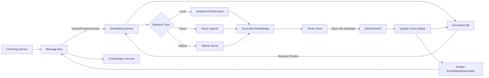

<!-- SPDX-License-Identifier: MIT
  Copyright (c) 2025 Copilot-for-Consensus contributors -->
# Embedding Generation Service

> **Note:** The embedding provider implementation has been moved to the `copilot_embedding` SDK module located in `adapter/copilot_embedding/`. This allows the embedding provider to be shared across multiple services. See the [SDK README](../adapter/copilot_embedding/README.md) for detailed documentation on the embedding provider API.

## Overview

The Embedding Generation Service converts text chunks into high-dimensional vector embeddings for semantic search and retrieval-augmented generation (RAG). This service supports multiple embedding backends including local offline models (SentenceTransformers), cloud APIs (Azure OpenAI), and Ollama-compatible models, enabling both fully self-contained and cloud-integrated deployments.

## Purpose

Generate vector embeddings for text chunks that:
- Enable semantic similarity search across mailing list content
- Support retrieval-augmented generation for summarization
- Facilitate topic clustering and trend analysis
- Enable cross-thread semantic navigation

## Responsibilities

- **Multi-Backend Support:** Generate embeddings using local, cloud, or hybrid backends
- **Vector Generation:** Convert text chunks into dense vector representations
- **Vector Store Integration:** Store embeddings with metadata in vector database
- **Batch Processing:** Efficiently process multiple chunks in parallel
- **Model Management:** Load and cache embedding models for optimal performance
- **Metadata Preservation:** Attach chunk metadata to vectors for filtering and retrieval
- **Event Publishing:** Notify downstream services when embeddings are generated
- **Error Handling:** Retry failed embedding generation with backoff

## Technology Stack

- **Language:** Python 3.11+
- **Core Libraries:**
  - `sentence-transformers` for local embedding models
  - `openai` SDK for Azure OpenAI integration
  - `qdrant-client` for Qdrant vector store
  - `pymongo` for document database integration
  - `pika` (RabbitMQ) or Azure SDK for message bus
  - `torch` (CPU or CUDA) for model inference
- **Vector Store:** Qdrant, FAISS, Azure Cognitive Search, or Milvus

## Configuration

### Environment Variables

| Variable | Type | Required | Default | Description |
|----------|------|----------|---------|-------------|
| `MESSAGE_BUS_HOST` | String | Yes | `messagebus` | Message bus hostname |
| `MESSAGE_BUS_PORT` | Integer | No | `5672` | Message bus port |
| `MESSAGE_BUS_USER` | String | No | `guest` | Message bus username |
| `MESSAGE_BUS_PASSWORD` | String | No | `guest` | Message bus password |
| `DOC_DB_HOST` | String | Yes | `documentdb` | Document database hostname |
| `DOC_DB_PORT` | Integer | No | `27017` | Document database port |
| `DOC_DB_NAME` | String | No | `copilot` | Database name |
| `VECTOR_DB_HOST` | String | Yes | `vectorstore` | Vector store hostname |
| `VECTOR_DB_PORT` | Integer | No | `6333` | Vector store port (Qdrant) |
| `VECTOR_DB_COLLECTION` | String | No | `message_embeddings` | Collection name |
| `EMBEDDING_BACKEND` | String | No | `sentencetransformers` | Backend: sentencetransformers, azure, openai, ollama |
| `EMBEDDING_MODEL` | String | No | `all-MiniLM-L6-v2` | Model name/identifier |
| `EMBEDDING_DIMENSION` | Integer | No | `384` | Embedding vector dimension |
| `BATCH_SIZE` | Integer | No | `32` | Batch size for embedding generation |
| `MAX_SEQUENCE_LENGTH` | Integer | No | `512` | Maximum token length for model |
| `DEVICE` | String | No | `cpu` | Device for inference: cpu, cuda, mps |
| `MODEL_CACHE_DIR` | String | No | `/root/.cache` | Directory for cached models |
| `AZURE_OPENAI_KEY` | String | No | - | Azure OpenAI API key (if using Azure) |
| `AZURE_OPENAI_ENDPOINT` | String | No | - | Azure OpenAI endpoint URL |
| `AZURE_OPENAI_DEPLOYMENT` | String | No | `text-embedding-ada-002` | Azure deployment name |
| `OPENAI_API_KEY` | String | No | - | OpenAI API key (if using OpenAI) |
| `OLLAMA_HOST` | String | No | `http://ollama:11434` | Ollama server URL |
| `OLLAMA_MODEL` | String | No | `nomic-embed-text` | Ollama embedding model |
| `LOG_LEVEL` | String | No | `INFO` | Logging level |
| `RETRY_MAX_ATTEMPTS` | Integer | No | `3` | Max retry attempts |
| `RETRY_BACKOFF_SECONDS` | Integer | No | `5` | Base backoff time |

### Embedding Backend Configuration

#### SentenceTransformers (Local)

```python
# Default configuration for fully offline operation
EMBEDDING_BACKEND=sentencetransformers
EMBEDDING_MODEL=all-MiniLM-L6-v2  # 384 dimensions
# Alternative: sentence-transformers/all-mpnet-base-v2 (768 dimensions)
DEVICE=cpu  # or cuda if GPU available
```

#### Azure OpenAI

```python
EMBEDDING_BACKEND=azure
AZURE_OPENAI_KEY=your-api-key
AZURE_OPENAI_ENDPOINT=https://your-resource.openai.azure.com/
AZURE_OPENAI_DEPLOYMENT=text-embedding-ada-002
EMBEDDING_DIMENSION=1536
```

#### OpenAI

```python
EMBEDDING_BACKEND=openai
OPENAI_API_KEY=your-api-key
EMBEDDING_MODEL=text-embedding-ada-002
EMBEDDING_DIMENSION=1536
```

#### Ollama

```python
EMBEDDING_BACKEND=ollama
OLLAMA_HOST=http://ollama:11434
OLLAMA_MODEL=nomic-embed-text  # or mxbai-embed-large
EMBEDDING_DIMENSION=768
```

## Events

### Events Subscribed To

The Embedding Service subscribes to the following events. See [SCHEMA.md](../documents/SCHEMA.md#message-bus-event-schemas) for complete event schemas.

#### 1. ChunksPrepared

Consumes events from the Chunking Service when text chunks are ready.

**Exchange:** `copilot.events`  
**Routing Key:** `chunks.prepared`

See [ChunksPrepared schema](../documents/SCHEMA.md#5-chunksprepared) in SCHEMA.md for the complete payload definition.

**Processing:**
1. Retrieve chunks from document database using `chunk_ids`
2. Extract text content from each chunk
3. Generate embeddings using configured backend
4. Store embeddings in vector store with metadata
5. Update chunks in document database (`embedding_generated = True`)
6. Publish `EmbeddingsGenerated` event

### Events Published

The Embedding Service publishes the following events. See [SCHEMA.md](../documents/SCHEMA.md#message-bus-event-schemas) for complete event schemas.

#### 1. EmbeddingsGenerated

Published when embeddings are successfully generated and stored.

**Exchange:** `copilot.events`  
**Routing Key:** `embeddings.generated`

See [EmbeddingsGenerated schema](../documents/SCHEMA.md#7-embeddingsgenerated) in SCHEMA.md for the complete payload definition.

**Key Fields:**
- `chunk_ids`: List of chunk UUIDs that were embedded
- `embedding_count`: Total number of embeddings generated
- `embedding_model`: Model identifier used for generation
- `embedding_backend`: Backend used (sentencetransformers, azure, etc.)
- `embedding_dimension`: Dimension of embedding vectors
- `vector_store_collection`: Collection where embeddings are stored
- `vector_store_updated`: Confirmation that vector store is updated
- `avg_generation_time_ms`: Average time per embedding (for monitoring)

#### 2. EmbeddingGenerationFailed

Published when embedding generation fails.

**Exchange:** `copilot.events`  
**Routing Key:** `embeddings.failed`

See [EmbeddingGenerationFailed schema](../documents/SCHEMA.md#8-embeddinggenerationfailed) in SCHEMA.md for the complete payload definition.

**Key Fields:**
- `chunk_ids`: List of chunk UUIDs that failed
- `error_message`, `error_type`: Error details
- `embedding_backend`: Backend that was attempted
- `retry_count`: Number of retry attempts


**Payload Schema:**
```json
{
  "event_type": "EmbeddingGenerationFailed",
  "event_id": "880e8400-e29b-41d4-a716-446655440001",
  "timestamp": "2023-10-15T14:47:00Z",
  "version": "1.0",
  "data": {
    "chunk_ids": [
      "a1b2c3d4-e5f6-7890-abcd-ef1234567890"
    ],
    "error_message": "Model inference timeout",
    "error_type": "TimeoutError",
    "embedding_backend": "sentencetransformers",
    "retry_count": 3,
    "failed_at": "2023-10-15T14:47:00Z"
  }
}
```

## Data Flow



## Embedding Generation

### Vector Store Schema

Each embedding is stored with rich metadata:

```python
{
    "id": "a1b2c3d4-e5f6-7890-abcd-ef1234567890",  # chunk_id
    "vector": [0.123, -0.456, 0.789, ...],  # 384 or 1536 dimensions
    "payload": {
        "chunk_id": "a1b2c3d4-e5f6-7890-abcd-ef1234567890",
        "message_id": "<20231015123456.ABC123@example.com>",
        "thread_id": "<20231015120000.XYZ789@example.com>",
        "archive_id": "7c9e6679-7425-40de-944b-e07fc1f90ae7",
        "chunk_index": 0,
        "text": "I agree with the proposed approach...",
        "sender": "alice@example.com",
        "sender_name": "Alice Developer",
        "date": "2023-10-15T12:34:56Z",
        "subject": "Re: QUIC connection migration concerns",
        "draft_mentions": ["draft-ietf-quic-transport-34"],
        "token_count": 350,
        "embedding_model": "all-MiniLM-L6-v2",
        "embedding_backend": "sentencetransformers",
        "embedding_date": "2023-10-15T14:45:00Z"
    }
}
```

### Embedding Generation Logic

```python
async def generate_embeddings(chunks: List[Dict]) -> List[Dict]:
    """
    Generate embeddings for a batch of chunks.
    
    Args:
        chunks: List of chunk documents from database
        
    Returns:
        List of embedding objects with vectors and metadata
    """
    # 1. Extract text content
    texts = [chunk["text"] for chunk in chunks]
    
    # 2. Generate embeddings based on backend
    if embedding_config.backend == "sentencetransformers":
        vectors = generate_local_embeddings(texts)
    elif embedding_config.backend == "azure":
        vectors = await generate_azure_embeddings(texts)
    elif embedding_config.backend == "ollama":
        vectors = await generate_ollama_embeddings(texts)
    else:
        raise ValueError(f"Unknown backend: {embedding_config.backend}")
    
    # 3. Create embedding objects with metadata
    embeddings = []
    for chunk, vector in zip(chunks, vectors):
        embedding = {
            "id": chunk["chunk_id"],
            "vector": vector,
            "payload": {
                "chunk_id": chunk["chunk_id"],
                "message_id": chunk["message_id"],
                "thread_id": chunk["thread_id"],
                "archive_id": chunk["archive_id"],
                "chunk_index": chunk["chunk_index"],
                "text": chunk["text"],
                "sender": chunk["metadata"]["sender"],
                "sender_name": chunk["metadata"]["sender_name"],
                "date": chunk["metadata"]["date"],
                "subject": chunk["metadata"]["subject"],
                "draft_mentions": chunk["metadata"].get("draft_mentions", []),
                "token_count": chunk["token_count"],
                "embedding_model": embedding_config.model,
                "embedding_backend": embedding_config.backend,
                "embedding_date": datetime.utcnow().isoformat()
            }
        }
        embeddings.append(embedding)
    
    return embeddings


def generate_local_embeddings(texts: List[str]) -> List[List[float]]:
    """
    Generate embeddings using local SentenceTransformers model.
    """
    from sentence_transformers import SentenceTransformer
    
    # Load model (cached after first load)
    model = SentenceTransformer(
        embedding_config.model,
        device=embedding_config.device,
        cache_folder=embedding_config.cache_dir
    )
    
    # Generate embeddings
    embeddings = model.encode(
        texts,
        batch_size=embedding_config.batch_size,
        show_progress_bar=False,
        normalize_embeddings=True
    )
    
    return embeddings.tolist()


async def generate_azure_embeddings(texts: List[str]) -> List[List[float]]:
    """
    Generate embeddings using Azure OpenAI.
    """
    from openai import AzureOpenAI
    
    client = AzureOpenAI(
        api_key=embedding_config.azure_key,
        api_version="2024-02-01",
        azure_endpoint=embedding_config.azure_endpoint
    )
    
    # Batch requests (Azure supports up to 2048 inputs)
    response = await client.embeddings.create(
        input=texts,
        model=embedding_config.azure_deployment
    )
    
    return [item.embedding for item in response.data]


async def generate_ollama_embeddings(texts: List[str]) -> List[List[float]]:
    """
    Generate embeddings using Ollama server.
    """
    import httpx
    
    embeddings = []
    async with httpx.AsyncClient() as client:
        for text in texts:
            response = await client.post(
                f"{embedding_config.ollama_host}/api/embeddings",
                json={
                    "model": embedding_config.ollama_model,
                    "prompt": text
                }
            )
            response.raise_for_status()
            embeddings.append(response.json()["embedding"])
    
    return embeddings
```

### Processing Loop

```python
async def process_chunks_prepared_event(event: ChunksPreparedEvent):
    """
    Process a ChunksPrepared event and generate embeddings.
    """
    try:
        # 1. Retrieve chunks from database
        chunks = list(db.chunks.find({
            "chunk_id": {"$in": event.data.chunk_ids}
        }))
        
        if not chunks:
            logger.warning(f"No chunks found for IDs: {event.data.chunk_ids}")
            return
        
        # 2. Generate embeddings in batches
        all_embeddings = []
        for i in range(0, len(chunks), embedding_config.batch_size):
            batch = chunks[i:i + embedding_config.batch_size]
            embeddings = await generate_embeddings(batch)
            all_embeddings.extend(embeddings)
            
            logger.info(f"Generated {len(embeddings)} embeddings")
        
        # 3. Store embeddings in vector store
        vector_store.upsert(
            collection_name=embedding_config.collection,
            points=all_embeddings
        )
        
        # 4. Update chunk status in document database
        db.chunks.update_many(
            {"chunk_id": {"$in": event.data.chunk_ids}},
            {"$set": {"embedding_generated": True}}
        )
        
        # 5. Publish EmbeddingsGenerated event
        await publish_embeddings_generated_event(
            chunk_ids=event.data.chunk_ids,
            model=embedding_config.model,
            backend=embedding_config.backend
        )
        
        logger.info(f"Successfully generated {len(all_embeddings)} embeddings")
        
    except Exception as e:
        logger.error(f"Embedding generation failed: {e}")
        await publish_embedding_generation_failed_event(
            chunk_ids=event.data.chunk_ids,
            error=str(e)
        )
        raise
```

## API Endpoints

### GET /health

Health check endpoint.

**Response:**
```json
{
  "status": "healthy",
  "service": "embedding",
  "version": "1.0.0",
  "backend": "sentencetransformers",
  "model": "all-MiniLM-L6-v2",
  "dimension": 384,
  "embeddings_generated_total": 12450,
  "uptime_seconds": 3600
}
```

### POST /embed

Generate embeddings for arbitrary text (testing/debug).

**Request:**
```json
{
  "texts": [
    "This is a test sentence.",
    "Another example text."
  ]
}
```

**Response:**
```json
{
  "embeddings": [
    [0.123, -0.456, 0.789, ...],
    [0.234, -0.567, 0.890, ...]
  ],
  "model": "all-MiniLM-L6-v2",
  "dimension": 384
}
```

### GET /stats

Get embedding generation statistics.

**Response:**
```json
{
  "total_embeddings": 12450,
  "avg_generation_time_ms": 15.3,
  "backend": "sentencetransformers",
  "model": "all-MiniLM-L6-v2",
  "dimension": 384,
  "vector_store_size": 12450
}
```

## Error Handling

### Error Types

- `ModelLoadError`: Failed to load embedding model
- `VectorStoreConnectionError`: Cannot connect to vector store
- `EmbeddingGenerationError`: Model inference failed
- `BatchSizeExceededError`: Batch too large for backend
- `APIKeyError`: Invalid API key for cloud backend
- `TimeoutError`: Embedding generation timeout

### Retry Logic

- Failed chunks are retried up to 3 times with exponential backoff
- Cloud API rate limits trigger automatic backoff
- Dead-letter queue for permanently failed chunks

## Monitoring & Observability

### Metrics

Prometheus metrics on `/metrics`:

- `embedding_chunks_processed_total`: Total chunks processed (labeled by status)
- `embedding_generation_duration_seconds`: Histogram of generation time
- `embedding_model_load_duration_seconds`: Model loading time
- `embedding_vector_dimension`: Configured dimension
- `embedding_failures_total`: Total failures (labeled by error_type, backend)
- `embedding_api_calls_total`: API calls for cloud backends

### Logs

Structured JSON logging:

```json
{
  "timestamp": "2023-10-15T14:45:00Z",
  "level": "INFO",
  "service": "embedding",
  "message": "Embeddings generated successfully",
  "context": {
    "chunk_count": 45,
    "backend": "sentencetransformers",
    "model": "all-MiniLM-L6-v2",
    "avg_time_ms": 15.3,
    "dimension": 384
  }
}
```

## Dependencies

### Runtime Dependencies

- **Message Bus:** RabbitMQ or Azure Service Bus
- **Document Database:** MongoDB for chunk retrieval
- **Vector Store:** Qdrant, FAISS, or Azure Cognitive Search

### Service Dependencies

- **Chunking Service:** Provides chunks via `ChunksPrepared` events
- **Orchestration Service:** Consumes embeddings for RAG workflows

### Optional Dependencies

- **Ollama Server:** If using Ollama backend
- **Azure OpenAI:** If using Azure backend

## Development

### Running Locally

```bash
# Install dependencies
pip install -r requirements.txt

# Download model (for local backend)
python -c "from sentence_transformers import SentenceTransformer; SentenceTransformer('all-MiniLM-L6-v2')"

# Set environment variables
export MESSAGE_BUS_HOST=localhost
export DOC_DB_HOST=localhost
export VECTOR_DB_HOST=localhost
export EMBEDDING_BACKEND=sentencetransformers

# Run the service
python main.py
```

### Running in Docker

```bash
# Build image
docker build -t copilot-embedding .

# Run container
docker run -d \
  -e MESSAGE_BUS_HOST=messagebus \
  -e DOC_DB_HOST=documentdb \
  -e VECTOR_DB_HOST=vectorstore \
  -e EMBEDDING_BACKEND=sentencetransformers \
  copilot-embedding
```

### Testing

```bash
# Run unit tests
pytest tests/

# Test embedding generation
pytest tests/test_embedding.py -v

# Integration tests
pytest tests/integration/ --integration
```

## Model Selection Guide

| Model | Dimension | Speed | Quality | Use Case |
|-------|-----------|-------|---------|----------|
| all-MiniLM-L6-v2 | 384 | Fast | Good | Offline, resource-constrained |
| all-mpnet-base-v2 | 768 | Medium | Better | Balanced performance |
| text-embedding-ada-002 (Azure/OpenAI) | 1536 | Fast (API) | Best | Cloud deployment, high quality |
| nomic-embed-text (Ollama) | 768 | Medium | Good | Local with Ollama |

## Future Enhancements

- [ ] Multi-modal embedding support (code, diagrams)
- [ ] Embedding fine-tuning on domain data
- [ ] Quantized models for faster inference
- [ ] GPU batch optimization
- [ ] Embedding cache for duplicate text
- [ ] Async batch processing with queue
- [ ] Multi-language embedding support
- [ ] Embedding quality validation
