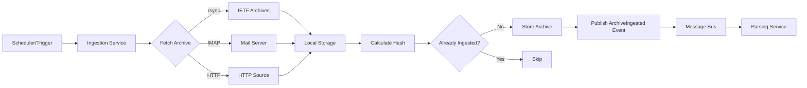

<!-- SPDX-License-Identifier: MIT
  Copyright (c) 2025 Copilot-for-Consensus contributors -->
# Ingestion Service

## Overview

The Ingestion Service is the entry point for the Copilot-for-Consensus data pipeline. It fetches mailing list archives from remote sources (IETF, mailing list servers, etc.) and makes them available for downstream processing. This service runs on a configurable schedule and publishes events when new archives are successfully ingested.

## Purpose

Fetch mailing list archives (e.g., `.mbox` files) from various sources and store them locally for processing by the Parsing & Normalization Service.

## Responsibilities

- **Scheduled Synchronization:** Periodically fetch archives from configured sources
- **Source Management:** Support multiple source types (rsync, IMAP, HTTP downloads, local filesystem)
- **Storage Management:** Store raw archives in configured storage location (local volumes, blob storage)
- **Deduplication:** Track previously ingested archives to avoid reprocessing
- **Event Publishing:** Notify downstream services when new archives are available
- **Error Handling:** Retry failed fetches with exponential backoff
- **Audit Logging:** Record all ingestion operations for compliance and debugging

## Technology Stack

- **Language:** Python 3.11+
- **Core Libraries:**
  - `rsync` wrapper for IETF archive synchronization
  - `imapclient` for IMAP-based mail retrieval
  - `requests` for HTTP downloads
  - `pika` (RabbitMQ) or Azure SDK for message bus integration
- **Storage:** Local filesystem or cloud blob storage (Azure Blob, S3)

## Configuration

### Environment Variables

| Variable | Type | Required | Default | Description |
|----------|------|----------|---------|-------------|
| `STORAGE_PATH` | String | Yes | `/data/raw_archives` | Local path for storing raw archives |
| `MESSAGE_BUS_HOST` | String | Yes | `messagebus` | Message bus hostname |
| `MESSAGE_BUS_PORT` | Integer | No | `5672` | Message bus port |
| `MESSAGE_BUS_USER` | String | No | `guest` | Message bus username |
| `MESSAGE_BUS_PASSWORD` | String | No | `guest` | Message bus password |
| `INGESTION_SCHEDULE_CRON` | String | No | `0 */6 * * *` | Cron schedule for ingestion (default: every 6 hours) |
| `BLOB_STORAGE_ENABLED` | Boolean | No | `false` | Enable cloud blob storage |
| `BLOB_STORAGE_CONNECTION_STRING` | String | No | - | Azure Blob or S3 connection string |
| `BLOB_STORAGE_CONTAINER` | String | No | `raw-archives` | Blob storage container name |
| `LOG_LEVEL` | String | No | `INFO` | Logging level (DEBUG, INFO, WARNING, ERROR) |
| `RETRY_MAX_ATTEMPTS` | Integer | No | `3` | Maximum retry attempts for failed fetches |
| `RETRY_BACKOFF_SECONDS` | Integer | No | `60` | Base backoff time for retries |

### Configuration File

The service also supports a configuration file (`config.yaml`) for defining archive sources:

```yaml
sources:
  - name: "ietf-quic"
    type: "rsync"
    url: "rsync://rsync.ietf.org/ietf-mail-archive/quic/"
    enabled: true
    
  - name: "ietf-tls"
    type: "rsync"
    url: "rsync://rsync.ietf.org/ietf-mail-archive/tls/"
    enabled: true
    
  - name: "custom-imap"
    type: "imap"
    host: "imap.example.com"
    port: 993
    username: "${IMAP_USERNAME}"
    password: "${IMAP_PASSWORD}"
    folder: "INBOX"
    enabled: false
```

## Events

### Events Subscribed To

**None.** The Ingestion Service is the entry point of the pipeline and does not consume events from other services. It operates on a schedule or can be triggered manually via API.

### Events Published

#### 1. ArchiveIngested

Published when an archive is successfully fetched and stored.

**Exchange:** `copilot.events`  
**Routing Key:** `archive.ingested`

**Payload Schema:**
```json
{
  "event_type": "ArchiveIngested",
  "event_id": "550e8400-e29b-41d4-a716-446655440000",
  "timestamp": "2023-10-15T14:30:00Z",
  "version": "1.0",
  "data": {
    "archive_id": "7c9e6679-7425-40de-944b-e07fc1f90ae7",
    "source_name": "ietf-quic",
    "source_type": "rsync",
    "source_url": "rsync://rsync.ietf.org/ietf-mail-archive/quic/",
    "file_path": "/data/raw_archives/ietf-quic/2023-10.mbox",
    "file_size_bytes": 2048576,
    "file_hash_sha256": "a1b2c3d4e5f6...",
    "ingestion_started_at": "2023-10-15T14:25:00Z",
    "ingestion_completed_at": "2023-10-15T14:30:00Z"
  }
}
```

**Field Descriptions:**
- `archive_id`: Unique identifier for the ingested archive (UUID)
- `source_name`: Name of the configured source
- `source_type`: Type of source (rsync, imap, http, local)
- `source_url`: Original URL/path of the archive
- `file_path`: Local storage path where archive is saved
- `file_size_bytes`: Size of the ingested file in bytes
- `file_hash_sha256`: SHA-256 hash for deduplication and integrity
- `ingestion_started_at`: When the fetch operation began
- `ingestion_completed_at`: When the fetch operation completed

#### 2. ArchiveIngestionFailed

Published when an archive fetch fails after all retry attempts.

**Exchange:** `copilot.events`  
**Routing Key:** `archive.ingestion.failed`

**Payload Schema:**
```json
{
  "event_type": "ArchiveIngestionFailed",
  "event_id": "550e8400-e29b-41d4-a716-446655440001",
  "timestamp": "2023-10-15T14:35:00Z",
  "version": "1.0",
  "data": {
    "source_name": "ietf-quic",
    "source_type": "rsync",
    "source_url": "rsync://rsync.ietf.org/ietf-mail-archive/quic/",
    "error_message": "Connection timeout after 30 seconds",
    "error_type": "TimeoutError",
    "retry_count": 3,
    "ingestion_started_at": "2023-10-15T14:25:00Z",
    "failed_at": "2023-10-15T14:35:00Z"
  }
}
```

## Data Flow



## Storage Structure

Archives are stored in a hierarchical directory structure:

```
/data/raw_archives/
├── ietf-quic/
│   ├── 2023-10.mbox
│   ├── 2023-11.mbox
│   └── 2023-12.mbox
├── ietf-tls/
│   ├── 2023-10.mbox
│   └── 2023-11.mbox
└── metadata/
    ├── ingestion_log.jsonl
    └── checksums.json
```

### Metadata Files

**ingestion_log.jsonl**: JSON Lines format log of all ingestion operations
```json
{"archive_id": "...", "source": "ietf-quic", "timestamp": "2023-10-15T14:30:00Z", "status": "success"}
{"archive_id": "...", "source": "ietf-tls", "timestamp": "2023-10-15T15:00:00Z", "status": "failed"}
```

**checksums.json**: Hash index for deduplication
```json
{
  "a1b2c3d4e5f6...": {
    "archive_id": "7c9e6679-7425-40de-944b-e07fc1f90ae7",
    "file_path": "/data/raw_archives/ietf-quic/2023-10.mbox",
    "first_seen": "2023-10-15T14:30:00Z"
  }
}
```

## API Endpoints

The service exposes a minimal HTTP API for health checks and manual triggering:

### GET /health

Health check endpoint.

**Response:**
```json
{
  "status": "healthy",
  "service": "ingestion",
  "version": "1.0.0",
  "uptime_seconds": 3600,
  "last_successful_ingestion": "2023-10-15T14:30:00Z"
}
```

### POST /ingest/{source_name}

Manually trigger ingestion for a specific source.

**Parameters:**
- `source_name`: Name of the configured source

**Response:**
```json
{
  "status": "triggered",
  "source_name": "ietf-quic",
  "job_id": "550e8400-e29b-41d4-a716-446655440002"
}
```

### GET /sources

List all configured sources and their status.

**Response:**
```json
{
  "sources": [
    {
      "name": "ietf-quic",
      "type": "rsync",
      "enabled": true,
      "last_success": "2023-10-15T14:30:00Z",
      "last_failure": null,
      "consecutive_failures": 0
    },
    {
      "name": "ietf-tls",
      "type": "rsync",
      "enabled": true,
      "last_success": "2023-10-15T12:00:00Z",
      "last_failure": null,
      "consecutive_failures": 0
    }
  ]
}
```

## Error Handling

### Retry Logic

Failed ingestion attempts are retried with exponential backoff:

1. **First attempt:** Immediate
2. **Second attempt:** Wait `RETRY_BACKOFF_SECONDS` (default: 60s)
3. **Third attempt:** Wait `RETRY_BACKOFF_SECONDS * 2` (default: 120s)
4. **After max attempts:** Publish `ArchiveIngestionFailed` event

### Error Types

- `ConnectionError`: Network connectivity issues
- `TimeoutError`: Operation exceeded timeout
- `AuthenticationError`: Invalid credentials for IMAP/authenticated sources
- `PermissionError`: Insufficient permissions to write to storage
- `IntegrityError`: Hash verification failed
- `ConfigurationError`: Invalid configuration

## Monitoring & Observability

### Metrics

The service exposes Prometheus metrics on `/metrics`:

- `ingestion_total`: Total number of ingestion attempts (labeled by source, status)
- `ingestion_duration_seconds`: Histogram of ingestion duration
- `ingestion_file_size_bytes`: Histogram of ingested file sizes
- `ingestion_failures_total`: Total number of failures (labeled by source, error_type)
- `ingestion_last_success_timestamp`: Unix timestamp of last successful ingestion (labeled by source)

### Logs

All operations are logged in structured JSON format:

```json
{
  "timestamp": "2023-10-15T14:30:00Z",
  "level": "INFO",
  "service": "ingestion",
  "message": "Archive ingested successfully",
  "context": {
    "archive_id": "7c9e6679-7425-40de-944b-e07fc1f90ae7",
    "source": "ietf-quic",
    "duration_seconds": 45.2,
    "file_size_bytes": 2048576
  }
}
```

## Dependencies

### Runtime Dependencies

- **Message Bus:** RabbitMQ or Azure Service Bus for event publishing
- **Storage:** Local filesystem or cloud blob storage

### Service Dependencies

**None.** The Ingestion Service has no dependencies on other microservices and can run independently.

## Development

### Running Locally

```bash
# Install dependencies
pip install -r requirements.txt

# Set environment variables
export STORAGE_PATH=/tmp/raw_archives
export MESSAGE_BUS_HOST=localhost

# Run the service
python main.py
```

### Running in Docker

```bash
# Build image
docker build -t copilot-ingestion .

# Run container
docker run -d \
  -e STORAGE_PATH=/data/raw_archives \
  -e MESSAGE_BUS_HOST=messagebus \
  -v /host/path/archives:/data/raw_archives \
  copilot-ingestion
```

### Testing

```bash
# Run unit tests
pytest tests/

# Run integration tests (requires message bus)
pytest tests/integration/ --integration
```

## Future Enhancements

- [ ] Support for additional source types (FTP, S3 direct)
- [ ] Incremental sync (fetch only new messages)
- [ ] Parallel ingestion from multiple sources
- [ ] Archive compression before storage
- [ ] Webhook support for push-based ingestion
- [ ] Real-time IMAP monitoring (IDLE command)
- [ ] Archive splitting for large files
- [ ] Built-in archive validation (mbox format check)
