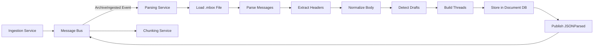

<!-- SPDX-License-Identifier: MIT
  Copyright (c) 2025 Copilot-for-Consensus contributors -->
# Parsing & Normalization Service

## Overview

The Parsing & Normalization Service converts raw mailing list archives (`.mbox` files) into structured JSON documents with clean, normalized text. This service extracts email headers, identifies thread relationships, removes noise (signatures, quoted replies, HTML tags), and stores parsed messages in the document database for downstream processing.

## Purpose

Transform raw `.mbox` archive files into structured, normalized message documents that:
- Extract all relevant email headers and metadata
- Clean and normalize message bodies for analysis
- Identify thread relationships via `Message-ID` and `In-Reply-To` headers
- Detect RFC/draft mentions in message content
- Enable efficient querying and retrieval via document database

## Responsibilities

- **Archive Parsing:** Parse `.mbox` files using Python's `mailbox` module
- **Header Extraction:** Extract standard email headers (`Message-ID`, `In-Reply-To`, `References`, `Subject`, `From`, `To`, `CC`, `Date`)
- **Thread Detection:** Build thread relationships using `Message-ID` and `In-Reply-To` references
- **Text Normalization:** Clean message bodies by:
  - Removing email signatures (standard delimiters like `--` or `___`)
  - Stripping quoted replies (lines starting with `>`, `>>`, etc.)
  - Removing HTML tags and converting to plain text
  - Normalizing whitespace and line breaks
- **Draft Mention Detection:** Identify RFC and draft references (e.g., `draft-ietf-quic-transport-34`, `RFC 9000`)
- **Storage:** Persist parsed messages and threads to document database
- **Event Publishing:** Notify downstream services when messages are parsed and ready

## Technology Stack

- **Language:** Python 3.10+
- **Core Libraries:**
  - `mailbox` for `.mbox` file parsing
  - `email` (standard library) for MIME parsing
  - `beautifulsoup4` for HTML stripping
  - `pymongo` for document database integration
  - `pika` (RabbitMQ) or Azure SDK for message bus integration
  - `regex` for draft/RFC mention detection
- **Storage:** MongoDB or Azure Cosmos DB for message persistence

## Configuration

### Environment Variables

| Variable | Type | Required | Default | Description |
|----------|------|----------|---------|-------------|
| `MESSAGE_BUS_HOST` | String | Yes | `messagebus` | Message bus hostname |
| `MESSAGE_BUS_PORT` | Integer | No | `5672` | Message bus port |
| `MESSAGE_BUS_USER` | String | No | `guest` | Message bus username |
| `MESSAGE_BUS_PASSWORD` | String | No | `guest` | Message bus password |
| `DOC_DB_HOST` | String | Yes | `documentdb` | Document database hostname |
| `DOC_DB_PORT` | Integer | No | `27017` | Document database port |
| `DOC_DB_NAME` | String | No | `copilot` | Database name |
| `DOC_DB_USER` | String | No | - | Database username (if auth enabled) |
| `DOC_DB_PASSWORD` | String | No | - | Database password (if auth enabled) |
| `LOG_LEVEL` | String | No | `INFO` | Logging level (DEBUG, INFO, WARNING, ERROR) |
| `BATCH_SIZE` | Integer | No | `100` | Number of messages to process in batch |
| `STRIP_SIGNATURES` | Boolean | No | `true` | Remove email signatures |
| `STRIP_QUOTED_REPLIES` | Boolean | No | `true` | Remove quoted reply text |
| `STRIP_HTML` | Boolean | No | `true` | Convert HTML to plain text |
| `DETECT_DRAFTS` | Boolean | No | `true` | Extract RFC/draft mentions |
| `DRAFT_REGEX_PATTERN` | String | No | See below | Regex pattern for draft detection |
| `MAX_BODY_LENGTH` | Integer | No | `1048576` | Max message body size (1MB) |

### Draft Detection Pattern

Default regex pattern for detecting RFC and draft mentions:
```
(draft-[a-z0-9-]+-\d+)|(RFC\s*\d+)|(rfc\d+)
```

Matches:
- `draft-ietf-quic-transport-34`
- `RFC 9000`
- `rfc9000`

## Events

### Events Subscribed To

The Parsing Service subscribes to the following events. See [SCHEMA.md](../documents/SCHEMA.md#message-bus-event-schemas) for complete event schemas.

#### 1. ArchiveIngested

Consumes events from the Ingestion Service when archives are ready for parsing.

**Exchange:** `copilot.events`  
**Routing Key:** `archive.ingested`

See [ArchiveIngested schema](../documents/SCHEMA.md#1-archiveingested) in SCHEMA.md for the complete payload definition.

**Processing:**
1. Load `.mbox` file from `file_path`
2. Parse each message in the archive
3. Extract headers and normalize body
4. Store messages in document database
5. Update thread relationships
6. Publish `JSONParsed` event

### Events Published

The Parsing Service publishes the following events. See [SCHEMA.md](../documents/SCHEMA.md#message-bus-event-schemas) for complete event schemas.

#### 1. JSONParsed

Published when an archive has been successfully parsed and messages are stored.

**Exchange:** `copilot.events`  
**Routing Key:** `json.parsed`

See [JSONParsed schema](../documents/SCHEMA.md#3-jsonparsed) in SCHEMA.md for the complete payload definition.

**Key Fields:**
- `archive_id`: Source archive hash (SHA256, first 16 chars)
- `message_count`: Number of messages parsed
- `parsed_message_ids`: List of all Message-IDs (for chunking service)
- `thread_count`: Number of distinct threads identified
- `thread_ids`: List of root Message-IDs for threads
- `parsing_duration_seconds`: Time taken to parse archive

#### 2. ParsingFailed

Published when archive parsing fails.

**Exchange:** `copilot.events`  
**Routing Key:** `parsing.failed`

See [ParsingFailed schema](../documents/SCHEMA.md#4-parsingfailed) in SCHEMA.md for the complete payload definition.

**Key Fields:**
- `archive_id`: Source archive hash (SHA256, first 16 chars)
- `file_path`: Path to the mbox file
- `error_message`, `error_type`: Error details
    "messages_parsed_before_failure": 75,
    "retry_count": 3,
    "failed_at": "2023-10-15T14:37:00Z"
  }
}
```

## Data Flow



## Message Structure

### Stored Document Schema

Each parsed message is stored in the `messages` collection:

```python
{
    "message_id": "<20231015123456.ABC123@example.com>",
    "archive_id": "b9c8d7e6f5a4b3c",
    "thread_id": "<20231015120000.XYZ789@example.com>",
    "in_reply_to": "<20231015120000.XYZ789@example.com>",
    "references": [
        "<20231015120000.XYZ789@example.com>",
        "<20231014150000.AAA111@example.com>"
    ],
    "subject": "Re: QUIC connection migration concerns",
    "from": {
        "name": "Alice Developer",
        "email": "alice@example.com"
    },
    "to": [
        {
            "name": "QUIC Working Group",
            "email": "quic@ietf.org"
        }
    ],
    "cc": [],
    "date": "2023-10-15T12:34:56Z",
    "body_raw": "Original email body with signatures...",
    "body_normalized": "I agree with the proposed approach for connection migration...",
    "body_html": "<p>I agree with the proposed approach...</p>",
    "headers": {
        "x-mailer": "Mozilla Thunderbird",
        "content-type": "text/plain; charset=utf-8"
    },
    "attachments": [
        {
            "filename": "diagram.png",
            "content_type": "image/png",
            "size_bytes": 45678
        }
    ],
    "draft_mentions": [
        "draft-ietf-quic-transport-34",
        "RFC 9000"
    ],
    "created_at": "2023-10-15T14:35:00Z"
}
```

### Thread Document Schema

Threads are aggregated in the `threads` collection:

```python
{
    "thread_id": "<20231015120000.XYZ789@example.com>",
    "archive_id": "b9c8d7e6f5a4b3c",
    "subject": "QUIC connection migration concerns",
    "participants": [
        {
            "name": "Alice Developer",
            "email": "alice@example.com"
        },
        {
            "name": "Bob Engineer",
            "email": "bob@example.com"
        }
    ],
    "message_count": 8,
    "first_message_date": "2023-10-15T09:00:00Z",
    "last_message_date": "2023-10-15T15:30:00Z",
    "draft_mentions": [
        "draft-ietf-quic-transport-34",
        "RFC 9000"
    ],
    "has_consensus": False,
    "consensus_type": None,
    "summary_id": None,
    "created_at": "2023-10-15T14:35:00Z"
}
```

## Parsing Algorithm

### Main Processing Logic

```python
async def process_archive_ingested_event(event: ArchiveIngestedEvent):
    """
    Process an ArchiveIngested event and parse messages.
    """
    try:
        archive_id = event.data.archive_id
        file_path = event.data.file_path
        
        logger.info(f"Parsing archive: {archive_id}")
        
        # 1. Load mbox file
        mbox = mailbox.mbox(file_path)
        
        # 2. Parse all messages
        parsed_messages = []
        parsed_message_ids = []
        
        for message in mbox:
            try:
                parsed = parse_message(message, archive_id)
                parsed_messages.append(parsed)
                parsed_message_ids.append(parsed["message_id"])
            except Exception as e:
                logger.warning(f"Failed to parse message: {e}")
                continue
        
        # 3. Build thread relationships
        threads = build_threads(parsed_messages)
        
        # 4. Store in database
        if parsed_messages:
            db.messages.insert_many(parsed_messages)
            logger.info(f"Stored {len(parsed_messages)} messages")
        
        if threads:
            db.threads.insert_many(threads)
            logger.info(f"Created {len(threads)} threads")
        
        # 5. Publish JSONParsed event
        await publish_json_parsed_event(
            archive_id=archive_id,
            message_count=len(parsed_messages),
            parsed_message_ids=parsed_message_ids,
            thread_count=len(threads)
        )
        
        logger.info(f"Parsing complete: {len(parsed_messages)} messages, {len(threads)} threads")
        
    except Exception as e:
        logger.error(f"Parsing failed: {e}")
        await publish_parsing_failed_event(
            archive_id=event.data.archive_id,
            file_path=event.data.file_path,
            error=str(e)
        )
        raise
```

### Message Parsing

```python
def parse_message(raw_message: mailbox.mboxMessage, archive_id: str) -> dict:
    """
    Parse a single email message and extract all fields.
    """
    # Extract headers
    message_id = raw_message.get("Message-ID", "").strip("<>")
    in_reply_to = raw_message.get("In-Reply-To", "").strip("<>")
    references = parse_references(raw_message.get("References", ""))
    subject = raw_message.get("Subject", "")
    date = parse_date(raw_message.get("Date", ""))
    
    # Extract addresses
    from_addr = parse_address(raw_message.get("From", ""))
    to_addrs = parse_address_list(raw_message.get("To", ""))
    cc_addrs = parse_address_list(raw_message.get("CC", ""))
    
    # Extract body
    body_raw = extract_body(raw_message)
    body_normalized = normalize_body(body_raw)
    body_html = extract_html_body(raw_message)
    
    # Extract attachments
    attachments = extract_attachments(raw_message)
    
    # Detect draft mentions
    draft_mentions = detect_drafts(body_normalized)
    
    # Determine thread_id (root message-id)
    thread_id = in_reply_to or message_id
    
    return {
        "message_id": message_id,
        "archive_id": archive_id,
        "thread_id": thread_id,
        "in_reply_to": in_reply_to,
        "references": references,
        "subject": subject,
        "from": from_addr,
        "to": to_addrs,
        "cc": cc_addrs,
        "date": date,
        "body_raw": body_raw,
        "body_normalized": body_normalized,
        "body_html": body_html,
        "headers": extract_extra_headers(raw_message),
        "attachments": attachments,
        "draft_mentions": draft_mentions,
        "created_at": datetime.utcnow()
    }
```

### Body Normalization

```python
def normalize_body(raw_body: str) -> str:
    """
    Clean and normalize message body.
    """
    text = raw_body
    
    # Strip HTML tags if present
    if config.strip_html and "<html" in text.lower():
        from bs4 import BeautifulSoup
        text = BeautifulSoup(text, "html.parser").get_text()
    
    # Remove email signatures
    if config.strip_signatures:
        text = remove_signature(text)
    
    # Remove quoted replies
    if config.strip_quoted_replies:
        text = remove_quoted_text(text)
    
    # Normalize whitespace
    text = re.sub(r'\n{3,}', '\n\n', text)  # Max 2 consecutive newlines
    text = re.sub(r'[ \t]+', ' ', text)     # Single spaces
    text = text.strip()
    
    return text

def remove_signature(text: str) -> str:
    """
    Remove email signature after common delimiters.
    """
    # Common signature delimiters
    delimiters = [
        "\n-- \n",
        "\n--\n",
        "\n___\n",
        "\n___________\n"
    ]
    
    for delimiter in delimiters:
        if delimiter in text:
            text = text.split(delimiter)[0]
            break
    
    return text

def remove_quoted_text(text: str) -> str:
    """
    Remove quoted reply lines (starting with > or >>).
    """
    lines = text.split('\n')
    filtered_lines = [
        line for line in lines 
        if not line.strip().startswith(('>', '|', '>>'))
    ]
    return '\n'.join(filtered_lines)
```

### Draft Detection

```python
def detect_drafts(text: str) -> List[str]:
    """
    Detect RFC and draft mentions in text.
    """
    if not config.detect_drafts:
        return []
    
    pattern = config.draft_regex_pattern or r'(draft-[a-z0-9-]+-\d+)|(RFC\s*\d+)|(rfc\d+)'
    matches = re.findall(pattern, text, re.IGNORECASE)
    
    # Flatten tuples and normalize
    drafts = []
    for match in matches:
        for group in match:
            if group:
                # Normalize RFC format
                if group.lower().startswith('rfc'):
                    group = 'RFC ' + re.search(r'\d+', group).group()
                drafts.append(group)
    
    return list(set(drafts))  # Remove duplicates
```

### Thread Building

```python
def build_threads(messages: List[dict]) -> List[dict]:
    """
    Build thread documents from parsed messages.
    """
    threads = {}
    
    for message in messages:
        thread_id = message["thread_id"]
        
        if thread_id not in threads:
            threads[thread_id] = {
                "thread_id": thread_id,
                "archive_id": message["archive_id"],
                "subject": message["subject"],
                "participants": [],
                "message_count": 0,
                "first_message_date": message["date"],
                "last_message_date": message["date"],
                "draft_mentions": set(),
                "created_at": datetime.utcnow()
            }
        
        thread = threads[thread_id]
        thread["message_count"] += 1
        
        # Update participants
        if message["from"] not in thread["participants"]:
            thread["participants"].append(message["from"])
        
        # Update date range
        if message["date"] < thread["first_message_date"]:
            thread["first_message_date"] = message["date"]
        if message["date"] > thread["last_message_date"]:
            thread["last_message_date"] = message["date"]
        
        # Aggregate draft mentions
        thread["draft_mentions"].update(message["draft_mentions"])
    
    # Convert sets to lists for storage
    for thread in threads.values():
        thread["draft_mentions"] = list(thread["draft_mentions"])
    
    return list(threads.values())
```

## API Endpoints

### GET /health

Health check endpoint.

**Response:**
```json
{
  "status": "healthy",
  "service": "parsing",
  "version": "1.0.0",
  "uptime_seconds": 3600,
  "messages_parsed_total": 15000,
  "threads_created_total": 3200,
  "last_processing_time_seconds": 12.5
}
```

### POST /parse/{archive_id}

Manually trigger parsing for a specific archive.

**Parameters:**
- `archive_id`: Archive hash (SHA256, first 16 chars) to parse

**Response:**
```json
{
  "status": "success",
  "archive_id": "b9c8d7e6f5a4b3c",
  "message_count": 150,
  "thread_count": 45
}
```

### GET /stats

Get parsing statistics.

**Response:**
```json
{
  "total_messages": 15000,
  "total_threads": 3200,
  "avg_messages_per_thread": 4.7,
  "archives_processed": 50,
  "avg_parsing_time_seconds": 11.8
}
```

## Error Handling

### Error Types

- `MboxParseError`: Corrupted or invalid mbox file
- `DatabaseConnectionError`: Cannot connect to document database
- `InvalidMessageFormatError`: Message missing required headers
- `MessageDuplicateError`: Message-ID already exists in database
- `DateParseError`: Cannot parse message date

### Retry Logic

- Failed events are retried up to 3 times with exponential backoff
- Partially parsed archives store successful messages before failure
- Permanently failed archives are logged for manual investigation

## Monitoring & Observability

### Metrics

Prometheus metrics exposed on `/metrics`:

- `parsing_archives_processed_total`: Total archives processed (labeled by status)
- `parsing_messages_parsed_total`: Total messages parsed
- `parsing_threads_created_total`: Total threads created
- `parsing_duration_seconds`: Histogram of archive parsing duration
- `parsing_message_size_bytes`: Histogram of message body sizes
- `parsing_failures_total`: Total failures (labeled by error_type)
- `parsing_draft_mentions_total`: Total draft mentions detected

### Logs

Structured JSON logging:

```json
{
  "timestamp": "2023-10-15T14:35:00Z",
  "level": "INFO",
  "service": "parsing",
  "message": "Archive parsed successfully",
  "context": {
    "archive_id": "b9c8d7e6f5a4b3c",
    "message_count": 150,
    "thread_count": 45,
    "duration_seconds": 12.5
  }
}
```

## Dependencies

### Runtime Dependencies

- **Message Bus:** RabbitMQ or Azure Service Bus
- **Document Database:** MongoDB or Azure Cosmos DB
- **File System:** Access to raw archive storage

### Service Dependencies

- **Ingestion Service:** Provides archives via `ArchiveIngested` events
- **Chunking Service:** Consumes messages via `JSONParsed` events

## Development

### Running Locally

```bash
# Install dependencies
pip install -r requirements.txt

# Set environment variables
export MESSAGE_BUS_HOST=localhost
export DOC_DB_HOST=localhost

# Run the service
python main.py
```

### Running in Docker

```bash
# Build image
docker build -t copilot-parsing .

# Run container
docker run -d \
  -e MESSAGE_BUS_HOST=messagebus \
  -e DOC_DB_HOST=documentdb \
  -v /host/archives:/data/raw_archives:ro \
  copilot-parsing
```

### Testing

```bash
# Run unit tests
pytest tests/

# Test parsing logic
pytest tests/test_parsing.py -v

# Integration tests
pytest tests/integration/ --integration
```

## Future Enhancements

- [ ] Parallel message parsing within archives
- [ ] Incremental parsing (skip already-parsed messages)
- [ ] Support for additional archive formats (Maildir, EML)
- [ ] Advanced quoted text detection (indented quotes)
- [ ] Language detection for messages
- [ ] Enhanced draft detection (version tracking)
- [ ] Attachment content extraction and indexing
- [ ] Message deduplication across archives
- [ ] Custom normalization rules per source
- [ ] MIME part handling for multipart messages
